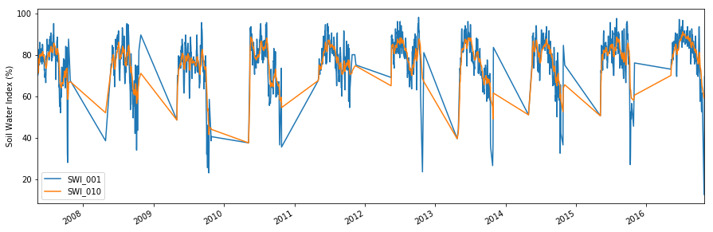

Example CGLS SWI time series
----------------------------

.. code:: ipython2

    import os
    from ascat.cgls import SWI_TS
    import matplotlib.pyplot as plt
    %matplotlib inline

By default we should have the grid file from the SWI-STATIC collection
and the unzipped SWI-TS products in one folder like so:

.. code:: ipython2

    ls ../tests/ascat_test_data/cglops/swi_ts

.. parsed-literal::

    c_gls_SWI-STATIC-DGG_201501010000_GLOBE_ASCAT_V3.0.1.nc
    c_gls_SWI-TS_201612310000_C0375_ASCAT_V3.0.1.nc

Now we can initialize the data reader

.. code:: ipython2

    data_path = os.path.join('..', 'tests', 'ascat_test_data', 'cglops', 'swi_ts')
    rd = SWI_TS(data_path)

With this object we can read the data

.. code:: ipython2

    data = rd.read_ts(3002621)
    print(data)

.. parsed-literal::

                         SSF  SWI_001  SWI_005  SWI_010  SWI_015  SWI_020  \
    2007-05-10 12:00:00  1.0     70.0     71.0     71.0     71.0     71.0   
    2007-05-14 12:00:00  1.0     71.5     71.5     71.5     71.5     71.5   
    2007-05-15 12:00:00  1.0     82.0     78.0     77.0     76.5     76.5   
    2007-05-16 12:00:00  1.0     82.5     79.0     78.0     77.5     77.0   
    2007-05-17 12:00:00  1.0     77.5     77.5     77.0     76.5     76.5   
    2007-05-18 12:00:00  1.0     75.0     76.5     76.0     76.0     76.0   
    2007-05-19 12:00:00  1.0     75.5     76.0     76.0     76.0     76.0   
    2007-05-20 12:00:00  1.0     86.0     81.0     79.5     79.5     79.0   
    2007-05-21 12:00:00  1.0     84.5     81.0     80.0     79.5     79.5   
    2007-05-22 12:00:00  1.0     81.5     80.5     80.0     79.5     79.0   
    2007-05-23 12:00:00  1.0     81.5     80.5     80.0     79.5     79.5   
    2007-05-24 12:00:00  1.0     81.0     81.0     80.0     80.0     79.5   
    2007-05-25 12:00:00  1.0     79.5     80.0     79.5     79.5     79.5   
    2007-05-26 12:00:00  1.0     81.5     80.5     80.0     79.5     79.5   
    2007-05-27 12:00:00  1.0     76.5     79.5     79.5     79.0     79.0   
    2007-05-28 12:00:00  1.0     80.5     79.5     79.5     79.5     79.5   
    2007-05-29 12:00:00  1.0     82.0     80.5     80.0     79.5     79.5   
    2007-05-30 12:00:00  1.0     83.0     81.0     80.5     80.0     80.0   
    2007-05-31 12:00:00  1.0     79.0     80.5     80.0     80.0     80.0   
    2007-06-01 12:00:00  1.0     75.5     79.5     79.5     79.5     79.5   
    2007-06-02 12:00:00  1.0     80.5     79.5     79.5     79.5     79.5   
    2007-06-03 12:00:00  1.0     85.0     81.5     80.5     80.5     80.0   
    2007-06-04 12:00:00  1.0     85.0     82.0     81.0     81.0     80.5   
    2007-06-05 12:00:00  1.0     84.5     82.0     81.5     81.0     81.0   
    2007-06-06 12:00:00  1.0     79.5     81.5     81.0     80.5     80.5   
    2007-06-07 12:00:00  1.0     77.5     80.0     80.0     80.0     80.0   
    2007-06-08 12:00:00  1.0     77.0     79.5     80.0     80.0     80.0   
    2007-06-09 12:00:00  1.0     77.0     79.5     79.5     80.0     80.0   
    2007-06-10 12:00:00  1.0     77.0     79.0     79.5     79.5     79.5   
    2007-06-11 12:00:00  1.0     76.5     78.0     79.0     79.0     79.5   
    ...                  ...      ...      ...      ...      ...      ...   
    2016-09-19 12:00:00  1.0     73.5     76.5     78.5     80.0     81.0   
    2016-09-20 12:00:00  1.0     74.5     76.0     78.5     80.0     81.0   
    2016-09-21 12:00:00  1.0     75.5     76.0     78.0     79.5     80.5   
    2016-09-22 12:00:00  1.0     73.5     75.5     77.5     79.0     80.5   
    2016-09-23 12:00:00  1.0     72.0     75.0     77.5     79.0     80.0   
    2016-09-24 12:00:00  1.0     69.5     73.5     76.5     78.0     79.5   
    2016-09-25 12:00:00  1.0     71.0     73.0     75.5     77.5     79.0   
    2016-09-26 12:00:00  1.0     71.5     73.0     75.5     77.0     78.5   
    2016-09-27 12:00:00  1.0     77.0     74.0     76.0     77.5     78.5   
    2016-09-28 12:00:00  1.0     83.5     76.0     76.5     78.0     79.0   
    2016-09-29 12:00:00  1.0     92.0     81.0     79.0     79.5     80.0   
    2016-09-30 12:00:00  1.0     93.5     82.5     80.0     80.0     80.5   
    2016-10-01 12:00:00  1.0     90.0     84.0     81.0     81.0     81.0   
    2016-10-02 12:00:00  1.0     84.0     83.5     81.0     80.5     81.0   
    2016-10-03 12:00:00  1.0     72.0     80.0     79.5     80.0     80.0   
    2016-10-04 12:00:00  1.0     64.5     76.0     77.5     78.5     79.0   
    2016-10-05 12:00:00  1.0     57.5     71.5     75.0     76.5     78.0   
    2016-10-06 12:00:00  1.0     65.0     70.5     74.0     75.5     77.0   
    2016-10-07 12:00:00  1.0     66.0     70.0     73.5     75.0     76.5   
    2016-10-08 12:00:00  1.0     68.0     69.5     73.0     75.0     76.0   
    2016-10-09 12:00:00  1.0     67.5     69.0     72.5     74.5     76.0   
    2016-10-10 12:00:00  1.0     65.5     68.5     71.5     74.0     75.5   
    2016-10-11 12:00:00  1.0     60.0     66.0     70.0     72.5     74.0   
    2016-10-12 12:00:00  1.0     54.0     63.5     68.5     71.0     73.0   
    2016-10-13 12:00:00  1.0     52.5     61.0     66.5     69.5     72.0   
    2016-10-14 12:00:00  1.0     55.0     60.0     65.5     69.0     71.0   
    2016-10-15 12:00:00  1.0     56.5     59.0     64.5     68.0     70.5   
    2016-10-16 12:00:00  1.0     61.5     60.0     64.5     67.5     70.0   
    2016-10-26 12:00:00  1.0     12.5     42.5     59.0     64.5     68.0   
    2016-10-28 12:00:00  1.0     69.5     54.0     60.0     64.5     67.5   
    
                         SWI_040  SWI_060  SWI_100  
    2007-05-10 12:00:00     71.0      NaN      NaN  
    2007-05-14 12:00:00     71.5     71.5      NaN  
    2007-05-15 12:00:00     76.0     76.0     76.0  
    2007-05-16 12:00:00     77.0     77.0     76.5  
    2007-05-17 12:00:00     76.0     76.0     76.0  
    2007-05-18 12:00:00     76.0     76.0     76.0  
    2007-05-19 12:00:00     76.0     75.5     75.5  
    2007-05-20 12:00:00     79.0     78.5     78.5  
    2007-05-21 12:00:00     79.0     79.0     79.0  
    2007-05-22 12:00:00     79.0     79.0     78.5  
    2007-05-23 12:00:00     79.0     79.0     79.0  
    2007-05-24 12:00:00     79.5     79.5     79.0  
    2007-05-25 12:00:00     79.0     79.0     79.0  
    2007-05-26 12:00:00     79.5     79.0     79.0  
    2007-05-27 12:00:00     79.0     79.0     79.0  
    2007-05-28 12:00:00     79.0     79.0     79.0  
    2007-05-29 12:00:00     79.5     79.5     79.0  
    2007-05-30 12:00:00     80.0     79.5     79.5  
    2007-05-31 12:00:00     79.5     79.5     79.5  
    2007-06-01 12:00:00     79.5     79.0     79.0  
    2007-06-02 12:00:00     79.5     79.0     79.0  
    2007-06-03 12:00:00     80.0     80.0     80.0  
    2007-06-04 12:00:00     80.5     80.0     80.0  
    2007-06-05 12:00:00     80.5     80.5     80.0  
    2007-06-06 12:00:00     80.5     80.0     80.0  
    2007-06-07 12:00:00     80.0     80.0     79.5  
    2007-06-08 12:00:00     80.0     79.5     79.5  
    2007-06-09 12:00:00     79.5     79.5     79.5  
    2007-06-10 12:00:00     79.5     79.5     79.5  
    2007-06-11 12:00:00     79.5     79.5     79.5  
    ...                      ...      ...      ...  
    2016-09-19 12:00:00     83.0     84.0     84.0  
    2016-09-20 12:00:00     83.0     83.5     84.0  
    2016-09-21 12:00:00     83.0     83.5     84.0  
    2016-09-22 12:00:00     82.5     83.5     83.5  
    2016-09-23 12:00:00     82.5     83.0     83.5  
    2016-09-24 12:00:00     82.0     83.0     83.5  
    2016-09-25 12:00:00     81.5     82.5     83.0  
    2016-09-26 12:00:00     81.5     82.5     83.0  
    2016-09-27 12:00:00     81.5     82.5     83.0  
    2016-09-28 12:00:00     81.5     82.5     83.0  
    2016-09-29 12:00:00     82.0     83.0     83.5  
    2016-09-30 12:00:00     82.0     83.0     83.5  
    2016-10-01 12:00:00     82.5     83.0     83.5  
    2016-10-02 12:00:00     82.5     83.0     83.5  
    2016-10-03 12:00:00     82.0     82.5     83.0  
    2016-10-04 12:00:00     81.5     82.5     83.0  
    2016-10-05 12:00:00     80.5     81.5     82.5  
    2016-10-06 12:00:00     80.0     81.5     82.0  
    2016-10-07 12:00:00     79.5     81.0     82.0  
    2016-10-08 12:00:00     79.5     81.0     82.0  
    2016-10-09 12:00:00     79.0     80.5     81.5  
    2016-10-10 12:00:00     79.0     80.5     81.5  
    2016-10-11 12:00:00     78.0     80.0     81.0  
    2016-10-12 12:00:00     77.5     79.5     81.0  
    2016-10-13 12:00:00     77.0     79.0     80.5  
    2016-10-14 12:00:00     76.5     78.5     80.0  
    2016-10-15 12:00:00     75.5     78.0     80.0  
    2016-10-16 12:00:00     75.5     78.0     79.5  
    2016-10-26 12:00:00     74.5     77.0     79.0  
    2016-10-28 12:00:00     74.0     76.5     79.0  
    
    [1603 rows x 9 columns]

Since the returned value is a pandas.DataFrame we can plot the data
easily.

.. code:: ipython2

    fig, ax = plt.subplots(1, 1, figsize=(15, 5))
    data[['SWI_001', 'SWI_010']].plot(ax=ax)
    ax.set_ylabel('Soil Water Index (%)')
    plt.show()

