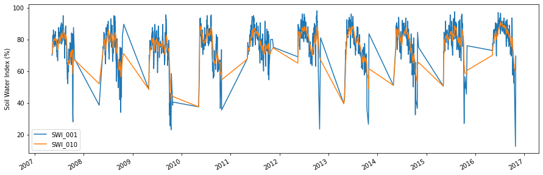

Example CGLS SWI time series
----------------------------

.. code:: ipython3

    import os
    from ascat.cgls import SWI_TS
    import matplotlib.pyplot as plt
    %matplotlib inline

By default we should have the grid file from the SWI-STATIC collection
and the unzipped SWI-TS products in one folder like so:

.. code:: ipython3

    ls ../tests/ascat_test_data/cglops/swi_ts

.. parsed-literal::

    c_gls_SWI-STATIC-DGG_201501010000_GLOBE_ASCAT_V3.0.1.nc
    c_gls_SWI-TS_201612310000_C0375_ASCAT_V3.0.1.nc

.. code:: ipython3

    data_path = os.path.join('..', 'tests', 'ascat_test_data', 'cglops', 'swi_ts')
    rd = SWI_TS(data_path)

.. code:: ipython3

    data = rd.read_ts(3002621)
    print(data)

.. parsed-literal::

                         SWI_001  SWI_005  SWI_010  SWI_015  SWI_020  SWI_040  \
    2007-05-10 12:00:00     70.0     71.0     71.0     71.0     71.0     71.0   
    2007-05-14 12:00:00     71.5     71.5     71.5     71.5     71.5     71.5   
    2007-05-15 12:00:00     82.0     78.0     77.0     76.5     76.5     76.0   
    2007-05-16 12:00:00     82.5     79.0     78.0     77.5     77.0     77.0   
    2007-05-17 12:00:00     77.5     77.5     77.0     76.5     76.5     76.0   
    ...                      ...      ...      ...      ...      ...      ...   
    2016-10-14 12:00:00     55.0     60.0     65.5     69.0     71.0     76.5   
    2016-10-15 12:00:00     56.5     59.0     64.5     68.0     70.5     75.5   
    2016-10-16 12:00:00     61.5     60.0     64.5     67.5     70.0     75.5   
    2016-10-26 12:00:00     12.5     42.5     59.0     64.5     68.0     74.5   
    2016-10-28 12:00:00     69.5     54.0     60.0     64.5     67.5     74.0   
    
                         SWI_060  SWI_100  SSF  
    2007-05-10 12:00:00      NaN      NaN  1.0  
    2007-05-14 12:00:00     71.5      NaN  1.0  
    2007-05-15 12:00:00     76.0     76.0  1.0  
    2007-05-16 12:00:00     77.0     76.5  1.0  
    2007-05-17 12:00:00     76.0     76.0  1.0  
    ...                      ...      ...  ...  
    2016-10-14 12:00:00     78.5     80.0  1.0  
    2016-10-15 12:00:00     78.0     80.0  1.0  
    2016-10-16 12:00:00     78.0     79.5  1.0  
    2016-10-26 12:00:00     77.0     79.0  1.0  
    2016-10-28 12:00:00     76.5     79.0  1.0  
    
    [1603 rows x 9 columns]

Since the returned value is a pandas.DataFrame we can plot the data
easily.

.. code:: ipython3

    fig, ax = plt.subplots(1, 1, figsize=(15, 5))
    data[['SWI_001', 'SWI_010']].plot(ax=ax)
    ax.set_ylabel('Soil Water Index (%)')
    plt.show()

