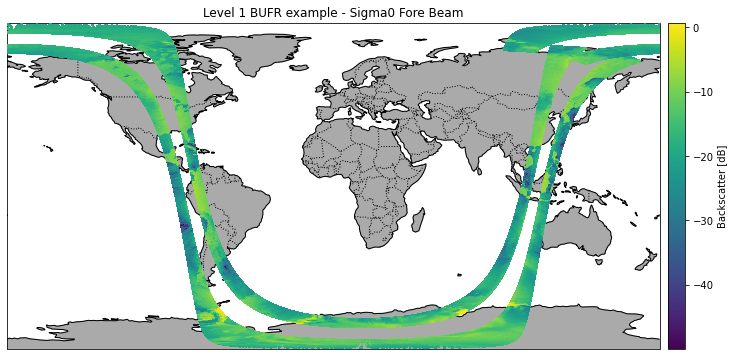
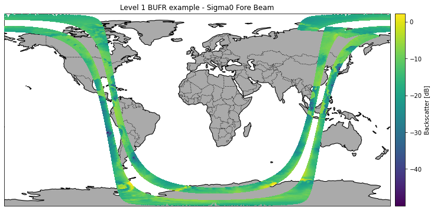
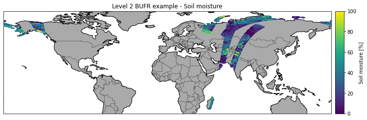

EUMETSAT
========

The following example show how to read ASCAT Level 1b and Level 2 data
in various formats (BUFR, EPS Native, netCDF). The data has been ordered
from the EUMETSAT Data Centre (https://eoportal.eumetsat.int).

ASCAT Level 1b
--------------

Read Level 1b BUFR file returning generic format
~~~~~~~~~~~~~~~~~~~~~~~~~~~~~~~~~~~~~~~~~~~~~~~~

.. code:: ipython3

    import os
    import cartopy
    from datetime import datetime
    import matplotlib.pyplot as plt
    
    from ascat.eumetsat.level1 import AscatL1bFile
    from ascat.eumetsat.level1 import AscatL1bBufrFile
    from ascat.eumetsat.level1 import AscatL1bBufrFileList
    from ascat.eumetsat.level1 import AscatL1bNcFile
    from ascat.eumetsat.level1 import AscatL1bNcFileList
    from ascat.eumetsat.level1 import AscatL1bEpsFile
    from ascat.eumetsat.level1 import AscatL1bEpsFileList
    from ascat.eumetsat.level1 import AscatL1bHdf5File
    from ascat.eumetsat.level1 import AscatL1bHdf5FileList

.. code:: ipython3

    path = os.path.join('..', 'tests','ascat_test_data', 'eumetsat',
                        'ASCAT_generic_reader_data')

.. code:: ipython3

    filename = os.path.join(path, 'bufr',
                            'M02-ASCA-ASCSZR1B0200-NA-9.1-20100609013900.000000000Z-20130824233100-1280350.bfr')
    
    bufr_file = AscatL1bFile(filename)
    data = bufr_file.read()
    data

.. parsed-literal::

    array([(68.91681, 168.80144, '2010-06-09T01:39:00.000', 18872,  1, 215., [63.32, 52.36, 63.4 ], [-13.51, -11.38, -13.51], [  6.68, 322.19, 277.56], [0, 0, 0], [1, 2, 3], [0.031, 0.036, 0.044], [0, 0, 0], [0.999, 1.   , 1.   ], 0,    0., 3, 1),
           (69.00519, 168.60977, '2010-06-09T01:39:00.000', 18872,  2, 215., [62.86, 51.89, 62.96], [-13.42, -11.13, -13.12], [  6.5 , 322.01, 277.38], [0, 0, 0], [1, 2, 3], [0.032, 0.033, 0.047], [0, 0, 0], [0.994, 0.998, 0.994], 0,    0., 3, 1),
           (69.09337, 168.41656, '2010-06-09T01:39:00.000', 18872,  3, 215., [62.41, 51.42, 62.49], [-13.87, -11.21, -13.46], [  6.33, 321.83, 277.2 ], [0, 0, 0], [1, 2, 3], [0.051, 0.035, 0.055], [0, 0, 0], [0.962, 0.966, 0.942], 0,    0., 3, 1),
           ...,
           (75.06332,  94.81529, '2010-06-09T03:20:58.000', 18873, 80, 211., [62.91, 51.42, 62.93], [-20.72, -18.1 , -21.4 ], [ 49.34,  95.85, 142.29], [0, 0, 0], [1, 2, 3], [0.054, 0.058, 0.051], [0, 0, 0], [1.   , 1.   , 1.   ], 1, 3263., 3, 1),
           (75.07438,  94.38296, '2010-06-09T03:20:58.000', 18873, 81, 211., [63.38, 51.89, 63.39], [-20.03, -17.17, -20.9 ], [ 48.89,  95.43, 141.91], [0, 0, 0], [1, 2, 3], [0.06 , 0.056, 0.059], [0, 0, 0], [1.   , 1.   , 1.   ], 1, 3263., 3, 1),
           (75.08462,  93.95003, '2010-06-09T03:20:58.000', 18873, 82, 211., [63.85, 52.35, 63.85], [-19.63, -16.91, -20.82], [ 48.43,  95.02, 141.52], [0, 0, 0], [1, 2, 3], [0.063, 0.058, 0.061], [0, 0, 0], [1.   , 1.   , 1.   ], 1, 3263., 3, 1)],
          dtype=[('lat', '<f4'), ('lon', '<f4'), ('time', '<M8[ms]'), ('abs_orbit_nr', '<i4'), ('node_num', 'u1'), ('sat_track_azi', '<f4'), ('inc', '<f4', (3,)), ('sig', '<f4', (3,)), ('azi', '<f4', (3,)), ('f_usable', 'u1', (3,)), ('beam_num', 'u1', (3,)), ('kp', '<f4', (3,)), ('kp_quality', 'u1', (3,)), ('f_land', '<f4', (3,)), ('swath_indicator', '<i8'), ('line_num', '<f8'), ('sat_id', 'u1'), ('as_des_pass', 'u1')])

.. code:: ipython3

    plot_crs = cartopy.crs.PlateCarree()
    data_crs = cartopy.crs.PlateCarree()
    
    fig = plt.figure(figsize=(12, 6))
    ax = fig.add_subplot(1, 1, 1, projection=plot_crs)
    ax.set_title('Level 1 BUFR example - Sigma0 Fore Beam')
    
    ax.add_feature(cartopy.feature.COASTLINE, linestyle='-')
    ax.add_feature(cartopy.feature.BORDERS, linestyle=':')
    ax.add_feature(cartopy.feature.LAND, facecolor='#aaaaaa')
    
    float32_nan = -999999.
    valid = data['sig'][:, 0] != float32_nan
    
    sc = ax.scatter(data['lon'][valid], data['lat'][valid], 
                    c=data['sig'][valid, 0], zorder=3, marker='s', s=2,
                    transform=data_crs)
    
    cax = fig.add_axes([ax.get_position().x1+0.01, ax.get_position().y0,
                        0.02, ax.get_position().height])
    cbar = fig.colorbar(sc, ax=ax, cax=cax)
    cbar.set_label('Backscatter [dB]')

Read Level 1b BUFR file returning original format
~~~~~~~~~~~~~~~~~~~~~~~~~~~~~~~~~~~~~~~~~~~~~~~~~

.. code:: ipython3

    bufr_file = AscatL1bBufrFile(filename)
    data = bufr_file.read()
    data

.. parsed-literal::

    array([(68.91681, 168.80144, '2010-06-09T01:39:00.000', 4., 215., 18872.,  1., 1., 63.32,  6.68, -13.51, 3.1, 0., 0., 0.999, 2., 52.36, 322.19, -11.38, 3.6, 0., 0., 1.   , 3., 63.4 , 277.56, -13.51, 4.4, 0., 0., 1.   ),
           (69.00519, 168.60977, '2010-06-09T01:39:00.000', 4., 215., 18872.,  2., 1., 62.86,  6.5 , -13.42, 3.2, 0., 0., 0.994, 2., 51.89, 322.01, -11.13, 3.3, 0., 0., 0.998, 3., 62.96, 277.38, -13.12, 4.7, 0., 0., 0.994),
           (69.09337, 168.41656, '2010-06-09T01:39:00.000', 4., 215., 18872.,  3., 1., 62.41,  6.33, -13.87, 5.1, 0., 0., 0.962, 2., 51.42, 321.83, -11.21, 3.5, 0., 0., 0.966, 3., 62.49, 277.2 , -13.46, 5.5, 0., 0., 0.942),
           ...,
           (75.06332,  94.81529, '2010-06-09T03:20:58.000', 4., 211., 18873., 80., 1., 62.91, 49.34, -20.72, 5.4, 0., 0., 1.   , 2., 51.42,  95.85, -18.1 , 5.8, 0., 0., 1.   , 3., 62.93, 142.29, -21.4 , 5.1, 0., 0., 1.   ),
           (75.07438,  94.38296, '2010-06-09T03:20:58.000', 4., 211., 18873., 81., 1., 63.38, 48.89, -20.03, 6. , 0., 0., 1.   , 2., 51.89,  95.43, -17.17, 5.6, 0., 0., 1.   , 3., 63.39, 141.91, -20.9 , 5.9, 0., 0., 1.   ),
           (75.08462,  93.95003, '2010-06-09T03:20:58.000', 4., 211., 18873., 82., 1., 63.85, 48.43, -19.63, 6.3, 0., 0., 1.   , 2., 52.35,  95.02, -16.91, 5.8, 0., 0., 1.   , 3., 63.85, 141.52, -20.82, 6.1, 0., 0., 1.   )],
          dtype=[('lat', '<f4'), ('lon', '<f4'), ('time', '<M8[ms]'), ('Satellite Identifier', '<f8'), ('Direction Of Motion Of Moving Observing Platform', '<f8'), ('Orbit Number', '<f8'), ('Cross-Track Cell Number', '<f8'), ('f_Beam Identifier', '<f8'), ('f_Radar Incidence Angle', '<f8'), ('f_Antenna Beam Azimuth', '<f8'), ('f_Backscatter', '<f8'), ('f_Radiometric Resolution (Noise Value)', '<f8'), ('f_ASCAT KP Estimate Quality', '<f8'), ('f_ASCAT Sigma-0 Usability', '<f8'), ('f_ASCAT Land Fraction', '<f8'), ('m_Beam Identifier', '<f8'), ('m_Radar Incidence Angle', '<f8'), ('m_Antenna Beam Azimuth', '<f8'), ('m_Backscatter', '<f8'), ('m_Radiometric Resolution (Noise Value)', '<f8'), ('m_ASCAT KP Estimate Quality', '<f8'), ('m_ASCAT Sigma-0 Usability', '<f8'), ('m_ASCAT Land Fraction', '<f8'), ('a_Beam Identifier', '<f8'), ('a_Radar Incidence Angle', '<f8'), ('a_Antenna Beam Azimuth', '<f8'), ('a_Backscatter', '<f8'), ('a_Radiometric Resolution (Noise Value)', '<f8'), ('a_ASCAT KP Estimate Quality', '<f8'), ('a_ASCAT Sigma-0 Usability', '<f8'), ('a_ASCAT Land Fraction', '<f8')])

.. code:: ipython3

    plot_crs = cartopy.crs.PlateCarree()
    data_crs = cartopy.crs.PlateCarree()
    
    fig = plt.figure(figsize=(12, 6))
    ax = fig.add_subplot(1, 1, 1, projection=plot_crs)
    ax.set_title('Level 1 BUFR example - Sigma0 Fore Beam')
    
    ax.add_feature(cartopy.feature.COASTLINE, linestyle='-')
    ax.add_feature(cartopy.feature.BORDERS, linestyle=':')
    ax.add_feature(cartopy.feature.LAND, facecolor='#aaaaaa')
    
    bufr_nan = 1.7e+38
    valid = data['m_Backscatter'] != bufr_nan
    
    sc = ax.scatter(data['lon'][valid], data['lat'][valid], 
                    c=data['m_Backscatter'][valid], zorder=3, marker='s', s=2,
                    transform=data_crs)
    
    cax = fig.add_axes([ax.get_position().x1+0.01, ax.get_position().y0,
                        0.02, ax.get_position().height])
    cbar = fig.colorbar(sc, ax=ax, cax=cax)
    cbar.set_label('Backscatter [dB]')

Read Level 1b BUFR file using a timestamp
~~~~~~~~~~~~~~~~~~~~~~~~~~~~~~~~~~~~~~~~~

.. code:: ipython3

    bufr_path = os.path.join(path, 'bufr')
    
    bufr_file_list = AscatL1bBufrFileList(bufr_path)
    data = bufr_file_list.read(datetime(2010, 6, 9, 1, 39, 0))
    data

.. parsed-literal::

    array([(68.91681, 168.80144, '2010-06-09T01:39:00.000', 18872,  1, 215., [63.32, 52.36, 63.4 ], [-13.51, -11.38, -13.51], [  6.68, 322.19, 277.56], [0, 0, 0], [1, 2, 3], [0.031, 0.036, 0.044], [0, 0, 0], [0.999, 1.   , 1.   ], 0,    0., 3, 1),
           (69.00519, 168.60977, '2010-06-09T01:39:00.000', 18872,  2, 215., [62.86, 51.89, 62.96], [-13.42, -11.13, -13.12], [  6.5 , 322.01, 277.38], [0, 0, 0], [1, 2, 3], [0.032, 0.033, 0.047], [0, 0, 0], [0.994, 0.998, 0.994], 0,    0., 3, 1),
           (69.09337, 168.41656, '2010-06-09T01:39:00.000', 18872,  3, 215., [62.41, 51.42, 62.49], [-13.87, -11.21, -13.46], [  6.33, 321.83, 277.2 ], [0, 0, 0], [1, 2, 3], [0.051, 0.035, 0.055], [0, 0, 0], [0.962, 0.966, 0.942], 0,    0., 3, 1),
           ...,
           (75.06332,  94.81529, '2010-06-09T03:20:58.000', 18873, 80, 211., [62.91, 51.42, 62.93], [-20.72, -18.1 , -21.4 ], [ 49.34,  95.85, 142.29], [0, 0, 0], [1, 2, 3], [0.054, 0.058, 0.051], [0, 0, 0], [1.   , 1.   , 1.   ], 1, 3263., 3, 1),
           (75.07438,  94.38296, '2010-06-09T03:20:58.000', 18873, 81, 211., [63.38, 51.89, 63.39], [-20.03, -17.17, -20.9 ], [ 48.89,  95.43, 141.91], [0, 0, 0], [1, 2, 3], [0.06 , 0.056, 0.059], [0, 0, 0], [1.   , 1.   , 1.   ], 1, 3263., 3, 1),
           (75.08462,  93.95003, '2010-06-09T03:20:58.000', 18873, 82, 211., [63.85, 52.35, 63.85], [-19.63, -16.91, -20.82], [ 48.43,  95.02, 141.52], [0, 0, 0], [1, 2, 3], [0.063, 0.058, 0.061], [0, 0, 0], [1.   , 1.   , 1.   ], 1, 3263., 3, 1)],
          dtype=[('lat', '<f4'), ('lon', '<f4'), ('time', '<M8[ms]'), ('abs_orbit_nr', '<i4'), ('node_num', 'u1'), ('sat_track_azi', '<f4'), ('inc', '<f4', (3,)), ('sig', '<f4', (3,)), ('azi', '<f4', (3,)), ('f_usable', 'u1', (3,)), ('beam_num', 'u1', (3,)), ('kp', '<f4', (3,)), ('kp_quality', 'u1', (3,)), ('f_land', '<f4', (3,)), ('swath_indicator', '<i8'), ('line_num', '<f8'), ('sat_id', 'u1'), ('as_des_pass', 'u1')])

Read Level 1b EPS Native file returning original format
~~~~~~~~~~~~~~~~~~~~~~~~~~~~~~~~~~~~~~~~~~~~~~~~~~~~~~~

.. code:: ipython3

    filename = os.path.join(path, 'eps_nat',
                            'ASCA_SZR_1B_M02_20100609013900Z_20100609032058Z_R_O_20130824233100Z.nat')
    eps_file = AscatL1bEpsFile(filename)
    data = eps_file.read()
    data

.. parsed-literal::

    array([(0, 0, 214.83, 351320256, [-13.510671, -11.382582, -13.5115  ], [63.32, 52.36, 63.4 ], [  6.68   , 322.19   , 277.56   ], [0.0307, 0.0361, 0.0441], [82, 96, 73], [0, 0, 0], [0, 0, 0], [0., 0., 0.], [0., 0., 0.], [0., 0., 0.], [0., 0., 0.], [0., 0., 0.], [0., 0., 0.], [0.999, 1.   , 1.   ],  1,    0, 1, 0, '2010-06-09T01:39:00.000', 168.80144 , 68.91681 ),
           (0, 0, 214.83, 351320256, [-13.421737, -11.132718, -13.115975], [62.86, 51.89, 62.96], [  6.5    , 322.01   , 277.38   ], [0.032 , 0.0326, 0.0471], [73, 90, 74], [0, 0, 0], [0, 0, 0], [0., 0., 0.], [0., 0., 0.], [0., 0., 0.], [0., 0., 0.], [0., 0., 0.], [0., 0., 0.], [0.994, 0.998, 0.994],  2,    0, 1, 0, '2010-06-09T01:39:00.000', 168.60977 , 69.005196),
           (0, 0, 214.83, 351320256, [-13.872492, -11.210789, -13.458664], [62.41, 51.42, 62.49], [  6.33   , 321.83002, 277.2    ], [0.051 , 0.0354, 0.0554], [74, 96, 74], [0, 0, 0], [0, 0, 0], [0., 0., 0.], [0., 0., 0.], [0., 0., 0.], [0., 0., 0.], [0., 0., 0.], [0., 0., 0.], [0.962, 0.966, 0.942],  3,    0, 1, 0, '2010-06-09T01:39:00.000', 168.41656 , 69.09337 ),
           ...,
           (0, 0, 211.11, 351326782, [-20.722643, -18.104128, -21.399553], [62.91, 51.42, 62.93], [ 49.34   ,  95.85   , 142.29   ], [0.0543, 0.058 , 0.0511], [75, 96, 75], [0, 0, 0], [0, 0, 0], [0., 0., 0.], [0., 0., 0.], [0., 0., 0.], [0., 0., 0.], [0., 0., 0.], [0., 0., 0.], [1.   , 1.   , 1.   ], 80, 3263, 1, 1, '2010-06-09T03:20:58.125',  94.815285, 75.063324),
           (0, 0, 211.11, 351326782, [-20.026527, -17.170391, -20.897753], [63.38, 51.89, 63.39], [ 48.89   ,  95.43   , 141.91   ], [0.0601, 0.0563, 0.0593], [84, 90, 76], [0, 0, 0], [0, 0, 0], [0., 0., 0.], [0., 0., 0.], [0., 0., 0.], [0., 0., 0.], [0., 0., 0.], [0., 0., 0.], [1.   , 1.   , 1.   ], 81, 3263, 1, 1, '2010-06-09T03:20:58.125',  94.38296 , 75.07438 ),
           (0, 0, 211.11, 351326782, [-19.630312, -16.90997 , -20.816809], [63.85, 52.35, 63.85], [ 48.43   ,  95.02   , 141.52   ], [0.0633, 0.0582, 0.0605], [85, 90, 86], [0, 0, 0], [0, 0, 0], [0., 0., 0.], [0., 0., 0.], [0., 0., 0.], [0., 0., 0.], [0., 0., 0.], [0., 0., 0.], [1.   , 1.   , 1.   ], 82, 3263, 1, 1, '2010-06-09T03:20:58.125',  93.95003 , 75.08462 )],
          dtype=[('degraded_inst_mdr', 'u1'), ('degraded_proc_mdr', 'u1'), ('sat_track_azi', '<f4'), ('abs_line_number', '<i4'), ('sigma0_trip', '<f4', (3,)), ('inc_angle_trip', '<f4', (3,)), ('azi_angle_trip', '<f4', (3,)), ('kp', '<f4', (3,)), ('num_val_trip', '<u4', (3,)), ('f_kp', 'u1', (3,)), ('f_usable', 'u1', (3,)), ('f_f', '<f4', (3,)), ('f_v', '<f4', (3,)), ('f_oa', '<f4', (3,)), ('f_sa', '<f4', (3,)), ('f_tel', '<f4', (3,)), ('f_ref', '<f4', (3,)), ('f_land', '<f4', (3,)), ('node_num', 'u1'), ('line_num', '<u2'), ('as_des_pass', 'u1'), ('swath_indicator', 'u1'), ('time', '<M8[ms]'), ('lon', '<f4'), ('lat', '<f4')])

Read Level 1b NetCDF file returning original format
~~~~~~~~~~~~~~~~~~~~~~~~~~~~~~~~~~~~~~~~~~~~~~~~~~~

.. code:: ipython3

    filename = os.path.join(path, 'nc',
                            'W_XX-EUMETSAT-Darmstadt,SURFACE+SATELLITE,METOPA+ASCAT_C_EUMP_20100609013900_18872_eps_o_125_l1.nc')
    
    nc_file = AscatL1bNcFile(filename)
    data = nc_file.read()
    data

.. parsed-literal::

    /home/shahn/shahn/swdvlp/ascat/src/ascat/read_native/nc.py:105: UserWarning: WARNING: valid_max not used since it
    cannot be safely cast to variable data type
      var_data = fid.variables[var_name][:].filled(fill_value)

.. parsed-literal::

    array([('2010-06-09T01:39:00', 351320256, 0, 214.83, 0, 68.91680583, 168.80144057, [-2.14748365e+09, -2.14748365e+09, -2.14748365e+09], [0.0307, 0.0361, 0.0441], [63.32    , 52.36    , 63.399998], [  6.68   , 322.19   , 277.56   ], [82, 96, 73], [0, 0, 0], [0, 0, 0], [0., 0., 0.], [0., 0., 0.], [0., 0., 0.], [0., 0., 0.], [0., 0., 0.], [0., 0., 0.], [0.9990001 , 1.        , 1.        ]),
           ('2010-06-09T01:39:00', 351320256, 0, 214.83, 0, 69.00519383, 168.60977157, [-2.14748365e+09, -2.14748365e+09, -2.14748365e+09], [0.032 , 0.0326, 0.0471], [62.859997, 51.89    , 62.96    ], [  6.5    , 322.01   , 277.38   ], [73, 90, 74], [0, 0, 0], [0, 0, 0], [0., 0., 0.], [0., 0., 0.], [0., 0., 0.], [0., 0., 0.], [0., 0., 0.], [0., 0., 0.], [0.994     , 0.998     , 0.994     ]),
           ('2010-06-09T01:39:00', 351320256, 0, 214.83, 0, 69.09336583, 168.41655757, [-2.14748365e+09, -2.14748365e+09, -2.14748365e+09], [0.051 , 0.0354, 0.0554], [62.41    , 51.42    , 62.489998], [  6.33   , 321.83002, 277.2    ], [74, 96, 74], [0, 0, 0], [0, 0, 0], [0., 0., 0.], [0., 0., 0.], [0., 0., 0.], [0., 0., 0.], [0., 0., 0.], [0., 0., 0.], [0.9620001 , 0.966     , 0.94200003]),
           ...,
           ('2010-06-09T03:20:58', 351326782, 0, 211.11, 1, 75.06332181,  94.81528776, [-2.14748365e+09, -2.14748365e+09, -2.14748365e+09], [0.0543, 0.058 , 0.0511], [62.91    , 51.42    , 62.93    ], [ 49.34   ,  95.85   , 142.29   ], [75, 96, 75], [0, 0, 0], [0, 0, 0], [0., 0., 0.], [0., 0., 0.], [0., 0., 0.], [0., 0., 0.], [0., 0., 0.], [0., 0., 0.], [1.        , 1.        , 1.        ]),
           ('2010-06-09T03:20:58', 351326782, 0, 211.11, 1, 75.07437581,  94.38295976, [-2.14748365e+09, -2.14748365e+09, -2.14748365e+09], [0.0601, 0.0563, 0.0593], [63.379997, 51.89    , 63.39    ], [ 48.89   ,  95.43   , 141.91   ], [84, 90, 76], [0, 0, 0], [0, 0, 0], [0., 0., 0.], [0., 0., 0.], [0., 0., 0.], [0., 0., 0.], [0., 0., 0.], [0., 0., 0.], [1.        , 1.        , 1.        ]),
           ('2010-06-09T03:20:58', 351326782, 0, 211.11, 1, 75.08461581,  93.95002976, [-2.14748365e+09, -2.14748365e+09, -2.14748365e+09], [0.0633, 0.0582, 0.0605], [63.85    , 52.35    , 63.85    ], [ 48.43   ,  95.02   , 141.52   ], [85, 90, 86], [0, 0, 0], [0, 0, 0], [0., 0., 0.], [0., 0., 0.], [0., 0., 0.], [0., 0., 0.], [0., 0., 0.], [0., 0., 0.], [1.        , 1.        , 1.        ])],
          dtype=[('utc_line_nodes', '<M8[s]'), ('abs_line_number', '>i4'), ('as_des_pass', 'i1'), ('sat_track_azi', '<f4'), ('swath_indicator', 'i1'), ('latitude', '<f8'), ('longitude', '<f8'), ('sigma0_trip', '<f8', (3,)), ('kp', '<f4', (3,)), ('inc_angle_trip', '<f4', (3,)), ('azi_angle_trip', '<f4', (3,)), ('num_val_trip', '>u4', (3,)), ('f_kp', 'i1', (3,)), ('f_usable', 'i1', (3,)), ('f_f', '<f4', (3,)), ('f_v', '<f4', (3,)), ('f_oa', '<f4', (3,)), ('f_sa', '<f4', (3,)), ('f_tel', '<f4', (3,)), ('f_ref', '<f4', (3,)), ('f_land', '<f4', (3,))])

ASCAT Level 2
-------------

Read Level 2 BUFR file returning generic format
~~~~~~~~~~~~~~~~~~~~~~~~~~~~~~~~~~~~~~~~~~~~~~~

.. code:: ipython3

    import os
    import cartopy
    from datetime import datetime
    import matplotlib.pyplot as plt
    
    from ascat.eumetsat.level2 import AscatL2File
    from ascat.eumetsat.level2 import AscatL2BufrFile
    from ascat.eumetsat.level2 import AscatL2BufrFileList
    from ascat.eumetsat.level2 import AscatL2NcFile
    from ascat.eumetsat.level2 import AscatL2NcFileList
    from ascat.eumetsat.level2 import AscatL2EpsFile
    from ascat.eumetsat.level2 import AscatL2EpsFileList

.. code:: ipython3

    path = os.path.join('..', 'tests','ascat_test_data', 'eumetsat')

.. code:: ipython3

    bufr_path = os.path.join(path, 'ASCAT_L2_SM_125', 'bufr', 'Metop_B')
    filename = os.path.join(bufr_path, 'M01-ASCA-ASCSMR02-NA-5.0-20170220050900.000000000Z-20170220055833-1207110.bfr')
    bufr_file = AscatL2File(filename)
    data = bufr_file.read()
    data

.. parsed-literal::

    array([(64.74398, 105.99558, '2017-02-20T05:09:00.000', 22966,  1, 206., 29.2, 3.6, -11.77, 0.08, -0.09, 0., 4.25, -13.02, -8.76, 36.7, 1.7e+38, 0, 16, 100, 100, 100, 3, 2, [63.31, 52.35, 63.36], [-13.78, -12.86, -14.03], [356.33, 311.8 , 267.25], [0, 0, 0], [1, 2, 3], [4.5, 3.9, 3.8], [0., 0., 0.], [1.   , 1.   , 1.   ], 0,    0., 4, 1),
           (64.81854, 105.79933, '2017-02-20T05:09:00.000', 22966,  2, 206., 30.2, 3.8, -11.6 , 0.08, -0.09, 0., 4.13, -12.85, -8.72, 35.4, 1.7e+38, 0, 16, 100, 100, 100, 1, 3, [62.86, 51.89, 62.91], [-13.87, -12.57, -13.74], [356.15, 311.63, 267.08], [0, 0, 0], [1, 2, 3], [4.6, 3.7, 3.2], [0., 0., 0.], [1.   , 1.   , 1.   ], 0,    0., 4, 1),
           (64.89284, 105.60199, '2017-02-20T05:09:00.000', 22966,  3, 206., 35.7, 4.1, -11.22, 0.08, -0.09, 0., 4.05, -12.66, -8.61, 33.4, 1.7e+38, 0, 48, 100, 100, 100, 0, 5, [62.41, 51.42, 62.45], [-13.54, -12.15, -13.46], [355.97, 311.45, 266.9 ], [0, 0, 0], [1, 2, 3], [4.5, 3.7, 4.1], [0., 0., 0.], [1.   , 1.   , 1.   ], 0,    0., 4, 1),
           ...,
           (58.81395,  38.96368, '2017-02-20T06:53:58.000', 22967, 80, 198., 80. , 3.6,  -9.06, 0.09, -0.1 , 0., 3.98, -12.24, -8.26, 50.1, 1.7e+38, 4, 48,  99,  56,  99, 0, 0, [62.91, 51.43, 62.95], [-10.56, -10.12, -10.8 ], [ 49.74,  96.24, 142.57], [0, 0, 0], [1, 2, 3], [2.8, 3. , 2.6], [0., 0., 0.], [1.   , 1.   , 1.   ], 1, 3359., 4, 1),
           (58.82597,  38.74857, '2017-02-20T06:53:58.000', 22967, 81, 198., 78. , 3.7,  -9.24, 0.1 , -0.11, 0., 4.03, -12.38, -8.35, 49.9, 1.7e+38, 4, 16, 100,  56, 100, 0, 0, [63.38, 51.9 , 63.42], [-10.96, -10.23, -11.1 ], [ 49.53,  96.05, 142.41], [0, 0, 0], [1, 2, 3], [3.7, 3.3, 3.3], [0., 0., 0.], [0.998, 0.997, 0.997], 1, 3359., 4, 1),
           (58.83763,  38.5333 , '2017-02-20T06:53:58.000', 22967, 82, 198., 72.6, 4.2,  -9.81, 0.11, -0.12, 0., 4.13, -12.81, -8.68, 49.3, 1.7e+38, 4,  0,  99,  56,  99, 9, 1, [63.83, 52.36, 63.88], [-11.88, -10.71, -11.85], [ 49.31,  95.87, 142.26], [0, 0, 0], [1, 2, 3], [5.6, 5.6, 5.1], [0., 0., 0.], [0.943, 0.953, 0.929], 1, 3359., 4, 1)],
          dtype=[('lat', '<f4'), ('lon', '<f4'), ('time', '<M8[ms]'), ('abs_orbit_nr', '<i4'), ('node_num', 'u1'), ('sat_track_azi', '<f4'), ('sm', '<f4'), ('sm_noise', '<f4'), ('sig40', '<f4'), ('sig40_noise', '<f4'), ('slope40', '<f4'), ('slope40_noise', '<f4'), ('sm_sens', '<f4'), ('dry_sig40', '<f4'), ('wet_sig40', '<f4'), ('sm_mean', '<f4'), ('rf', '<f4'), ('corr_flag', 'u1'), ('proc_flag', 'u1'), ('agg_flag', 'u1'), ('snow_prob', 'u1'), ('frozen_prob', 'u1'), ('wetland', 'u1'), ('topo', 'u1'), ('inc', '<f4', (3,)), ('sig', '<f4', (3,)), ('azi', '<f4', (3,)), ('f_usable', 'u1', (3,)), ('beam_num', 'u1', (3,)), ('kp_noise', '<f4', (3,)), ('kp', '<f4', (3,)), ('f_land', '<f4', (3,)), ('swath_indicator', '<i8'), ('line_num', '<f8'), ('sat_id', 'u1'), ('as_des_pass', 'u1')])

.. code:: ipython3

    plot_crs = cartopy.crs.PlateCarree()
    data_crs = cartopy.crs.PlateCarree()
    
    fig = plt.figure(figsize=(12, 6))
    ax = fig.add_subplot(1, 1, 1, projection=plot_crs)
    ax.set_title('Level 2 BUFR example - Soil moisture')
    
    ax.add_feature(cartopy.feature.COASTLINE, linestyle='-')
    ax.add_feature(cartopy.feature.BORDERS, linestyle=':')
    ax.add_feature(cartopy.feature.LAND, facecolor='#aaaaaa')
    
    field = 'sm'
    float32_nan = -999999.
    valid = data[field] != float32_nan
    
    sc = ax.scatter(data['lon'][valid], data['lat'][valid], 
                    c=data[field][valid], zorder=3, marker='s', s=2,
                    transform=data_crs)
    
    cax = fig.add_axes([ax.get_position().x1+0.01, ax.get_position().y0,
                        0.02, ax.get_position().height])
    cbar = fig.colorbar(sc, ax=ax, cax=cax)
    cbar.set_label('Soil moisture [%]')

Read Level 2 BUFR file returning original format
~~~~~~~~~~~~~~~~~~~~~~~~~~~~~~~~~~~~~~~~~~~~~~~~

.. code:: ipython3

    bufr_file = AscatL2BufrFile(filename)
    data = bufr_file.read()
    data

.. parsed-literal::

    array([(64.74398, 105.99558, '2017-02-20T05:09:00.000', 3., 206., 22966.,  1., 1., 63.31, 356.33, -13.78, 4.5, 0., 0., 1.   , 2., 52.35, 311.8 , -12.86, 3.9, 0., 0., 1.   , 3., 63.36, 267.25, -14.03, 3.8, 0., 0., 1.   , 29.2, 3.6, -11.77, 0.08, -0.09, 0., 4.25, -13.02, -8.76, 36.7, 1.7e+38, 0., 16., 100., 100., 100., 3., 2.),
           (64.81854, 105.79933, '2017-02-20T05:09:00.000', 3., 206., 22966.,  2., 1., 62.86, 356.15, -13.87, 4.6, 0., 0., 1.   , 2., 51.89, 311.63, -12.57, 3.7, 0., 0., 1.   , 3., 62.91, 267.08, -13.74, 3.2, 0., 0., 1.   , 30.2, 3.8, -11.6 , 0.08, -0.09, 0., 4.13, -12.85, -8.72, 35.4, 1.7e+38, 0., 16., 100., 100., 100., 1., 3.),
           (64.89284, 105.60199, '2017-02-20T05:09:00.000', 3., 206., 22966.,  3., 1., 62.41, 355.97, -13.54, 4.5, 0., 0., 1.   , 2., 51.42, 311.45, -12.15, 3.7, 0., 0., 1.   , 3., 62.45, 266.9 , -13.46, 4.1, 0., 0., 1.   , 35.7, 4.1, -11.22, 0.08, -0.09, 0., 4.05, -12.66, -8.61, 33.4, 1.7e+38, 0., 48., 100., 100., 100., 0., 5.),
           ...,
           (58.81395,  38.96368, '2017-02-20T06:53:58.000', 3., 198., 22967., 80., 1., 62.91,  49.74, -10.56, 2.8, 0., 0., 1.   , 2., 51.43,  96.24, -10.12, 3. , 0., 0., 1.   , 3., 62.95, 142.57, -10.8 , 2.6, 0., 0., 1.   , 80. , 3.6,  -9.06, 0.09, -0.1 , 0., 3.98, -12.24, -8.26, 50.1, 1.7e+38, 4., 48.,  99.,  56.,  99., 0., 0.),
           (58.82597,  38.74857, '2017-02-20T06:53:58.000', 3., 198., 22967., 81., 1., 63.38,  49.53, -10.96, 3.7, 0., 0., 0.998, 2., 51.9 ,  96.05, -10.23, 3.3, 0., 0., 0.997, 3., 63.42, 142.41, -11.1 , 3.3, 0., 0., 0.997, 78. , 3.7,  -9.24, 0.1 , -0.11, 0., 4.03, -12.38, -8.35, 49.9, 1.7e+38, 4., 16., 100.,  56., 100., 0., 0.),
           (58.83763,  38.5333 , '2017-02-20T06:53:58.000', 3., 198., 22967., 82., 1., 63.83,  49.31, -11.88, 5.6, 0., 0., 0.943, 2., 52.36,  95.87, -10.71, 5.6, 0., 0., 0.953, 3., 63.88, 142.26, -11.85, 5.1, 0., 0., 0.929, 72.6, 4.2,  -9.81, 0.11, -0.12, 0., 4.13, -12.81, -8.68, 49.3, 1.7e+38, 4.,  0.,  99.,  56.,  99., 9., 1.)],
          dtype=[('lat', '<f4'), ('lon', '<f4'), ('time', '<M8[ms]'), ('Satellite Identifier', '<f8'), ('Direction Of Motion Of Moving Observing Platform', '<f8'), ('Orbit Number', '<f8'), ('Cross-Track Cell Number', '<f8'), ('f_Beam Identifier', '<f8'), ('f_Radar Incidence Angle', '<f8'), ('f_Antenna Beam Azimuth', '<f8'), ('f_Backscatter', '<f8'), ('f_Radiometric Resolution (Noise Value)', '<f8'), ('f_ASCAT KP Estimate Quality', '<f8'), ('f_ASCAT Sigma-0 Usability', '<f8'), ('f_ASCAT Land Fraction', '<f8'), ('m_Beam Identifier', '<f8'), ('m_Radar Incidence Angle', '<f8'), ('m_Antenna Beam Azimuth', '<f8'), ('m_Backscatter', '<f8'), ('m_Radiometric Resolution (Noise Value)', '<f8'), ('m_ASCAT KP Estimate Quality', '<f8'), ('m_ASCAT Sigma-0 Usability', '<f8'), ('m_ASCAT Land Fraction', '<f8'), ('a_Beam Identifier', '<f8'), ('a_Radar Incidence Angle', '<f8'), ('a_Antenna Beam Azimuth', '<f8'), ('a_Backscatter', '<f8'), ('a_Radiometric Resolution (Noise Value)', '<f8'), ('a_ASCAT KP Estimate Quality', '<f8'), ('a_ASCAT Sigma-0 Usability', '<f8'), ('a_ASCAT Land Fraction', '<f8'), ('Surface Soil Moisture (Ms)', '<f8'), ('Estimated Error In Surface Soil Moisture', '<f8'), ('Backscatter', '<f8'), ('Estimated Error In Sigma0 At 40 Deg Incidence Angle', '<f8'), ('Slope At 40 Deg Incidence Angle', '<f8'), ('Estimated Error In Slope At 40 Deg Incidence Angle', '<f8'), ('Soil Moisture Sensitivity', '<f8'), ('Dry Backscatter', '<f8'), ('Wet Backscatter', '<f8'), ('Mean Surface Soil Moisture', '<f8'), ('Rain Fall Detection', '<f8'), ('Soil Moisture Correction Flag', '<f8'), ('Soil Moisture Processing Flag', '<f8'), ('Soil Moisture Quality', '<f8'), ('Snow Cover', '<f8'), ('Frozen Land Surface Fraction', '<f8'), ('Inundation And Wetland Fraction', '<f8'), ('Topographic Complexity', '<f8')])

Read Level 2 BUFR file using a timestamp
~~~~~~~~~~~~~~~~~~~~~~~~~~~~~~~~~~~~~~~~

.. code:: ipython3

    bufr_path = os.path.join(path, 'ASCAT_L2_SM_125', 'bufr', 'Metop_B')
    bufr_file = AscatL2BufrFileList(bufr_path, sat='B')
    data = bufr_file.read(datetime(2017, 2, 20, 5, 9, 0))
    data

.. parsed-literal::

    array([(64.74398, 105.99558, '2017-02-20T05:09:00.000', 22966,  1, 206., 29.2, 3.6, -11.77, 0.08, -0.09, 0., 4.25, -13.02, -8.76, 36.7, 1.7e+38, 0, 16, 100, 100, 100, 3, 2, [63.31, 52.35, 63.36], [-13.78, -12.86, -14.03], [356.33, 311.8 , 267.25], [0, 0, 0], [1, 2, 3], [4.5, 3.9, 3.8], [0., 0., 0.], [1.   , 1.   , 1.   ], 0,    0., 4, 1),
           (64.81854, 105.79933, '2017-02-20T05:09:00.000', 22966,  2, 206., 30.2, 3.8, -11.6 , 0.08, -0.09, 0., 4.13, -12.85, -8.72, 35.4, 1.7e+38, 0, 16, 100, 100, 100, 1, 3, [62.86, 51.89, 62.91], [-13.87, -12.57, -13.74], [356.15, 311.63, 267.08], [0, 0, 0], [1, 2, 3], [4.6, 3.7, 3.2], [0., 0., 0.], [1.   , 1.   , 1.   ], 0,    0., 4, 1),
           (64.89284, 105.60199, '2017-02-20T05:09:00.000', 22966,  3, 206., 35.7, 4.1, -11.22, 0.08, -0.09, 0., 4.05, -12.66, -8.61, 33.4, 1.7e+38, 0, 48, 100, 100, 100, 0, 5, [62.41, 51.42, 62.45], [-13.54, -12.15, -13.46], [355.97, 311.45, 266.9 ], [0, 0, 0], [1, 2, 3], [4.5, 3.7, 4.1], [0., 0., 0.], [1.   , 1.   , 1.   ], 0,    0., 4, 1),
           ...,
           (58.81395,  38.96368, '2017-02-20T06:53:58.000', 22967, 80, 198., 80. , 3.6,  -9.06, 0.09, -0.1 , 0., 3.98, -12.24, -8.26, 50.1, 1.7e+38, 4, 48,  99,  56,  99, 0, 0, [62.91, 51.43, 62.95], [-10.56, -10.12, -10.8 ], [ 49.74,  96.24, 142.57], [0, 0, 0], [1, 2, 3], [2.8, 3. , 2.6], [0., 0., 0.], [1.   , 1.   , 1.   ], 1, 3359., 4, 1),
           (58.82597,  38.74857, '2017-02-20T06:53:58.000', 22967, 81, 198., 78. , 3.7,  -9.24, 0.1 , -0.11, 0., 4.03, -12.38, -8.35, 49.9, 1.7e+38, 4, 16, 100,  56, 100, 0, 0, [63.38, 51.9 , 63.42], [-10.96, -10.23, -11.1 ], [ 49.53,  96.05, 142.41], [0, 0, 0], [1, 2, 3], [3.7, 3.3, 3.3], [0., 0., 0.], [0.998, 0.997, 0.997], 1, 3359., 4, 1),
           (58.83763,  38.5333 , '2017-02-20T06:53:58.000', 22967, 82, 198., 72.6, 4.2,  -9.81, 0.11, -0.12, 0., 4.13, -12.81, -8.68, 49.3, 1.7e+38, 4,  0,  99,  56,  99, 9, 1, [63.83, 52.36, 63.88], [-11.88, -10.71, -11.85], [ 49.31,  95.87, 142.26], [0, 0, 0], [1, 2, 3], [5.6, 5.6, 5.1], [0., 0., 0.], [0.943, 0.953, 0.929], 1, 3359., 4, 1)],
          dtype=[('lat', '<f4'), ('lon', '<f4'), ('time', '<M8[ms]'), ('abs_orbit_nr', '<i4'), ('node_num', 'u1'), ('sat_track_azi', '<f4'), ('sm', '<f4'), ('sm_noise', '<f4'), ('sig40', '<f4'), ('sig40_noise', '<f4'), ('slope40', '<f4'), ('slope40_noise', '<f4'), ('sm_sens', '<f4'), ('dry_sig40', '<f4'), ('wet_sig40', '<f4'), ('sm_mean', '<f4'), ('rf', '<f4'), ('corr_flag', 'u1'), ('proc_flag', 'u1'), ('agg_flag', 'u1'), ('snow_prob', 'u1'), ('frozen_prob', 'u1'), ('wetland', 'u1'), ('topo', 'u1'), ('inc', '<f4', (3,)), ('sig', '<f4', (3,)), ('azi', '<f4', (3,)), ('f_usable', 'u1', (3,)), ('beam_num', 'u1', (3,)), ('kp_noise', '<f4', (3,)), ('kp', '<f4', (3,)), ('f_land', '<f4', (3,)), ('swath_indicator', '<i8'), ('line_num', '<f8'), ('sat_id', 'u1'), ('as_des_pass', 'u1')])

Read Level 2 EPS Native file returning original format
~~~~~~~~~~~~~~~~~~~~~~~~~~~~~~~~~~~~~~~~~~~~~~~~~~~~~~

.. code:: ipython3

    eps_path = os.path.join(path, 'ASCAT_generic_reader_data', 'eps_nat')
    filename = os.path.join(eps_path, 'ASCA_SMO_02_M01_20180612035700Z_20180612053856Z_N_O_20180612044530Z.nat')
    eps_file = AscatL2EpsFile(filename)
    data = eps_file.read()
    data

.. parsed-literal::

    array([([-13.027462, -12.173263, -13.108534], [63.3 , 52.35, 63.36], [355.03, 310.51, 265.95], [0.0319, 0.0253, 0.0305], [1.   , 1.   , 1.   ], 205.4, 620897088, 0, 69.11, 2.53, -11.258671, 0.066655, -0.09588 , 0.001581, -14.475467,  -9.821013, 77.97, 4.654454, 0, 48,  9,   0,  0, 9, 0,  True, 3, 3,  1,    0, '2018-06-12T03:56:59.999', 121.95572 , 64.06651 ),
           ([-12.636047, -11.945043, -12.790056], [62.39, 51.42, 62.44], [354.68, 310.16, 265.6 ], [0.0292, 0.0242, 0.0274], [1.   , 1.   , 1.   ], 205.4, 620897088, 0, 74.23, 2.67, -10.957491, 0.066048, -0.095214, 0.001407, -14.441333,  -9.748401, 77.57, 4.692932, 0, 48,  3,   0,  0, 3, 1,  True, 3, 3,  2,    0, '2018-06-12T03:56:59.999', 121.564156, 64.21156 ),
           ([-12.374401, -11.618511, -12.528789], [61.46, 50.45, 61.5 ], [354.33, 309.8 , 265.24], [0.0231, 0.02  , 0.0219], [1.   , 1.   , 1.   ], 205.4, 620897088, 0, 74.12, 2.62, -10.886627, 0.065569, -0.091289, 0.001603, -14.399154,  -9.660463, 79.2 , 4.73869 , 0, 16,  4,   0,  0, 4, 0,  True, 3, 3,  3,    0, '2018-06-12T03:56:59.999', 121.16849 , 64.355545),
           ...,
           ([-17.221464, -14.911518, -16.616632], [61.99, 50.46, 62.  ], [ 49.69,  96.2 , 142.57], [0.0434, 0.0368, 0.0433], [0.684, 0.683, 0.678], 203.6, 620903612, 1, 39.14, 3.63, -13.829233, 0.139443, -0.169973, 0.003226, -16.263618, -10.04545 , 56.73, 6.218168, 4, 48, 32, 255, 32, 0, 2,  True, 3, 3, 40, 1631, '2018-06-12T05:38:56.250',  59.128284, 68.44701 ),
           ([-17.093988, -14.874458, -16.460255], [62.94, 51.42, 62.95], [ 49.06,  95.63, 142.07], [0.0317, 0.0284, 0.031 ], [0.936, 0.916, 0.933], 203.6, 620903612, 1, 32.25, 3.62, -13.645713, 0.124113, -0.158086, 0.00313 , -15.526709,  -9.695139, 55.99, 5.831569, 4, 48, 32,  11, 32, 0, 1,  True, 3, 3, 41, 1631, '2018-06-12T05:38:56.250',  58.521664, 68.47014 ),
           ([-17.46779 , -15.250906, -16.675348], [63.86, 52.36, 63.88], [ 48.43,  95.07, 141.57], [0.0314, 0.0246, 0.0307], [0.922, 0.924, 0.934], 203.6, 620903612, 1, 29.02, 3.98, -13.880219, 0.13573 , -0.159536, 0.003409, -15.548345,  -9.801218, 54.19, 5.747126, 4, 16, 30,  11, 30, 0, 2,  True, 3, 3, 42, 1631, '2018-06-12T05:38:56.250',  57.91386 , 68.49107 )],
          dtype=[('sigma0_trip', '<f4', (3,)), ('inc_angle_trip', '<f4', (3,)), ('azi_angle_trip', '<f4', (3,)), ('kp', '<f4', (3,)), ('f_land', '<f4', (3,)), ('sat_track_azi', '<f4'), ('abs_line_number', '<i4'), ('swath_indicator', 'u1'), ('soil_moisture', '<f4'), ('soil_moisture_error', '<f4'), ('sigma40', '<f4'), ('sigma40_error', '<f4'), ('slope40', '<f4'), ('slope40_error', '<f4'), ('dry_backscatter', '<f4'), ('wet_backscatter', '<f4'), ('mean_surf_soil_moisture', '<f4'), ('soil_moisture_sensetivity', '<f4'), ('correction_flags', 'u1'), ('processing_flags', '<u2'), ('aggregated_quality_flag', 'u1'), ('snow_cover_probability', 'u1'), ('frozen_soil_probability', 'u1'), ('innudation_or_wetland', 'u1'), ('topographical_complexity', 'u1'), ('as_des_pass', '?'), ('param_db_version', '<u2'), ('warp_nrt_version', '<u2'), ('node_num', '<i8'), ('line_num', '<i8'), ('time', '<M8[ms]'), ('lon', '<f4'), ('lat', '<f4')])

Read Level 2 NetCDF file returning original format
~~~~~~~~~~~~~~~~~~~~~~~~~~~~~~~~~~~~~~~~~~~~~~~~~~

.. code:: ipython3

    nc_path = os.path.join(path, 'ASCAT_generic_reader_data', 'nc')
    filename = os.path.join(nc_path, 'W_XX-EUMETSAT-Darmstadt,SURFACE+SATELLITE,METOPB+ASCAT_C_EUMP_20180612035700_29742_eps_o_250_ssm_l2.nc')
    nc_file = AscatL2NcFile(filename)
    data = nc_file.read()
    data

.. parsed-literal::

    /home/shahn/shahn/swdvlp/ascat/src/ascat/read_native/nc.py:105: UserWarning: WARNING: valid_max not used since it
    cannot be safely cast to variable data type
      var_data = fid.variables[var_name][:].filled(fill_value)

.. parsed-literal::

    array([('2018-06-12T03:56:59', 620897088, 205.4    , 0, 0, 64.06651084, 121.95571769, 69.11    , 2.53     , -2.14748365e+09, 0.066655, -0.09588 , 0.001581, 4.65445399, -14.47546696,  -9.82101298, 77.97    , 255, 0,  0,  0,  9,   0,  0, 9, 0),
           ('2018-06-12T03:56:59', 620897088, 205.4    , 0, 0, 64.21155984, 121.56415469, 74.229996, 2.6699998, -2.14748365e+09, 0.066048, -0.095214, 0.001407, 4.69293199, -14.44133296,  -9.74840098, 77.57    , 255, 0, 48, 48,  3,   0,  0, 3, 1),
           ('2018-06-12T03:56:59', 620897088, 205.4    , 0, 0, 64.35554684, 121.16848369, 74.119995, 2.62     , -2.14748365e+09, 0.065569, -0.091289, 0.001603, 4.73868999, -14.39915396,  -9.66046298, 79.2     , 255, 0,  0,  0,  4,   0,  0, 4, 0),
           ...,
           ('2018-06-12T05:38:56', 620903612, 203.59999, 0, 1, 68.44700783,  59.12828285, 39.14    , 3.6299999, -2.14748365e+09, 0.139443, -0.169973, 0.003226, 6.21816798, -16.26361896, -10.04544997, 56.73    , 255, 4, 48, 48, 32, 255, 32, 0, 2),
           ('2018-06-12T05:38:56', 620903612, 203.59999, 0, 1, 68.47014083,  58.52166285, 32.25    , 3.62     , -2.14748365e+09, 0.124113, -0.158086, 0.00313 , 5.83156899, -15.52670896,  -9.69513898, 55.989998, 255, 4,  0,  0, 32,  11, 32, 0, 1),
           ('2018-06-12T05:38:56', 620903612, 203.59999, 0, 1, 68.49107383,  57.91385885, 29.019999, 3.98     , -2.14748365e+09, 0.13573 , -0.159536, 0.003409, 5.74712599, -15.54834496,  -9.80121798, 54.19    , 255, 4, 48, 48, 30,  11, 30, 0, 2)],
          dtype=[('utc_line_nodes', '<M8[s]'), ('abs_line_number', '>i4'), ('sat_track_azi', '<f4'), ('as_des_pass', 'i1'), ('swath_indicator', 'i1'), ('latitude', '<f8'), ('longitude', '<f8'), ('soil_moisture', '<f4'), ('soil_moisture_error', '<f4'), ('sigma40', '<f8'), ('sigma40_error', '<f8'), ('slope40', '<f8'), ('slope40_error', '<f8'), ('soil_moisture_sensitivity', '<f8'), ('dry_backscatter', '<f8'), ('wet_backscatter', '<f8'), ('mean_soil_moisture', '<f4'), ('rainfall_flag', 'u1'), ('corr_flags', 'u1'), ('proc_flag1', 'u1'), ('proc_flag2', 'u1'), ('aggregated_quality_flag', 'u1'), ('snow_cover_probability', 'u1'), ('frozen_soil_probability', 'u1'), ('wetland_flag', 'u1'), ('topography_flag', 'u1')])

