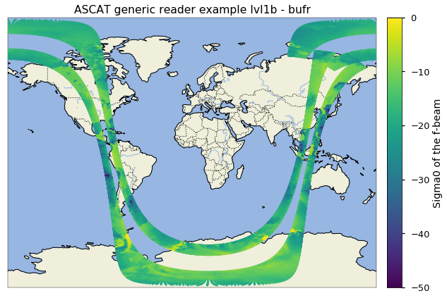
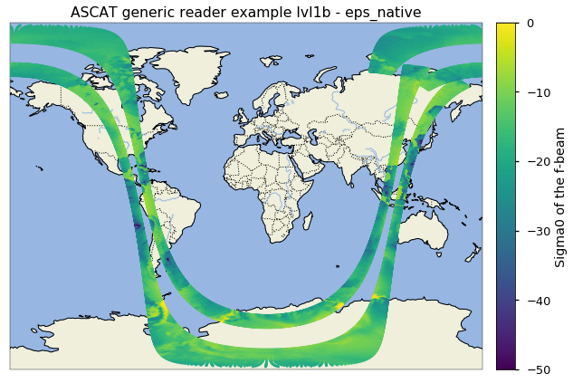
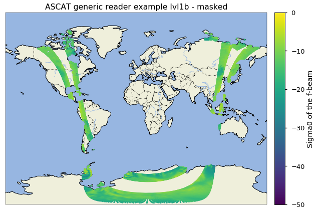
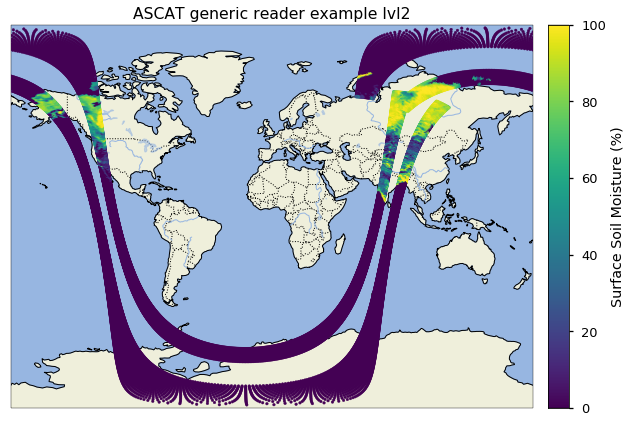

Example Generic Data Reader
---------------------------

In this Example we use the generic lvl1b and lvl2 readers to read files
in multiple formats (bufr, eps_native, netCDF). The datasets are from
the Data Centre of the EUMETSAT-EO Portal
(https://eoportal.eumetsat.int). Also simple plot scripts and simple
masking is shown. For the multitemporal class, where you can read
multiple orbit files, the process is only shown for bufr, but the
classes for the other formats work the same.

Level 1b
--------

First let’s do the import, set the path to the ascat_test_data and initialise the objects. The path for to the bufr ascat_test_data is split so we can use it for the MultiTemporal class.
~~~~~~~~~~~~~~~~~~~~~~~~~~~~~~~~~~~~~~~~~~~~~~~~~~~~~~~~~~~~~~~~~~~~~~~~~~~~~~~~~~~~~~~~~~~~~~~~~~~~~~~~~~~~~~~~~~~~~~~~~~~~~~~~~~~~~~~~~~~~~~~~~~~~~~~~~~~~~~~~~~~~~~~~~~~~~~

.. code:: ipython2

    import os
    import ascat.level1 as level1
    
    test_data_path = os.path.join('..', 'tests','ascat_test_data', 'eumetsat', 'ASCAT_generic_reader_data')
    bufr_file_path = os.path.join(test_data_path, 'bufr')
    single_file_path_bufr = os.path.join(bufr_file_path, 'M02-ASCA-ASCSZR1B0200-NA-9.1-20100609013900.000000000Z-20130824233100-1280350.bfr')
    single_file_path_eps = os.path.join(test_data_path, 'eps_nat', 'ASCA_SZR_1B_M02_20100609013900Z_20100609032058Z_R_O_20130824233100Z.nat')
    single_file_path_nc = os.path.join(test_data_path, 'nc', 'W_XX-EUMETSAT-Darmstadt,SURFACE+SATELLITE,METOPA+ASCAT_C_EUMP_20100609013900_18872_eps_o_125_l1.nc')
    
    
    single_reader_bufr = level1.AscatL1Image(single_file_path_bufr)
    single_reader_eps = level1.AscatL1Image(single_file_path_eps)
    single_reader_nc = level1.AscatL1Image(single_file_path_nc)
    multi_reader = level1.AscatL1Bufr(bufr_file_path)

Now let’s read the single lvl1b orbit files-
~~~~~~~~~~~~~~~~~~~~~~~~~~~~~~~~~~~~~~~~~~~~

.. code:: ipython2

    generic_image_bufr = single_reader_bufr.read()
    generic_image_eps = single_reader_eps.read()
    generic_image_nc = single_reader_nc.read()

Simple plot script for all three formats (should lead to the same result).
~~~~~~~~~~~~~~~~~~~~~~~~~~~~~~~~~~~~~~~~~~~~~~~~~~~~~~~~~~~~~~~~~~~~~~~~~~

.. code:: ipython2

    import cartopy
    from cartopy.mpl.geoaxes import GeoAxes
    import matplotlib.pyplot as plt
    from mpl_toolkits.axes_grid1 import AxesGrid
    
    data_crs = cartopy.crs.PlateCarree()
    proj = cartopy.crs.Miller()
    axes_class = (GeoAxes, dict(map_projection=proj))
    
    # image_list = [generic_image_bufr, generic_image_eps, generic_image_nc]
    image_dict = {'bufr': generic_image_bufr, 'eps_native': generic_image_eps, 'netCDF': generic_image_nc}
    for image in image_dict:
        lon = image_dict[image].lon
        lat = image_dict[image].lat
        data = image_dict[image].data['sigf']
    
        style_label = 'seaborn-talk'
        with plt.style.context(style_label):
            fig = plt.figure(figsize=(10, 8))
            ax = AxesGrid(fig, 111, axes_class=axes_class, nrows_ncols=(1, 1),
                          cbar_location='right', cbar_mode='single', cbar_pad=0.2,
                          cbar_size='4%', label_mode='')
    
    
            ax[0].set_title('ASCAT generic reader example lvl1b - ' + image)
    
            ax[0].add_feature(cartopy.feature.LAND)
            ax[0].add_feature(cartopy.feature.OCEAN)
            ax[0].add_feature(cartopy.feature.COASTLINE)
            ax[0].add_feature(cartopy.feature.BORDERS, linestyle=':')
            ax[0].add_feature(cartopy.feature.LAKES, alpha=0.5)
            ax[0].add_feature(cartopy.feature.RIVERS)
    
            ax[0].set_extent([-175, 175, -90, 90])
    
            sc = ax[0].scatter(lon, lat, c=data, s=7, marker='o', vmin=-50,
                               vmax=0, zorder=3, transform=data_crs)
    
            cbar = ax.cbar_axes[0].colorbar(sc)
            cbar.set_label_text('Sigma0 of the f-beam')
    
        plt.show()

If we want to filter the data regarding one or more variables, we can create a simple mask. Let’s try it for the land flag.
~~~~~~~~~~~~~~~~~~~~~~~~~~~~~~~~~~~~~~~~~~~~~~~~~~~~~~~~~~~~~~~~~~~~~~~~~~~~~~~~~~~~~~~~~~~~~~~~~~~~~~~~~~~~~~~~~~~~~~~~~~~

.. code:: ipython2

    import numpy as np
    
    data, meta, timestamp, lon, lat, time_var = generic_image_bufr
    
    valid = np.ones(data[data.dtype.names[0]].shape, dtype=np.bool)
    beams = ['f', 'm', 'a']
    
    for b in beams:
        valid = (valid & (data['land_flag' + b] > 0.095))
    
    data_masked = data[valid]
    lon_masked = lon[valid]
    lat_masked = lat[valid]

Let’s plot it to see the differences.
~~~~~~~~~~~~~~~~~~~~~~~~~~~~~~~~~~~~~

.. code:: ipython2

    lon = lon_masked
    lat = lat_masked
    data = data_masked['sigf']
    
    style_label = 'seaborn-talk'
    with plt.style.context(style_label):
        fig = plt.figure(figsize=(10, 8))
        ax = AxesGrid(fig, 111, axes_class=axes_class, nrows_ncols=(1, 1),
                      cbar_location='right', cbar_mode='single', cbar_pad=0.2,
                      cbar_size='4%', label_mode='')
    
    
        ax[0].set_title('ASCAT generic reader example lvl1b - masked')
    
        ax[0].add_feature(cartopy.feature.LAND)
        ax[0].add_feature(cartopy.feature.OCEAN)
        ax[0].add_feature(cartopy.feature.COASTLINE)
        ax[0].add_feature(cartopy.feature.BORDERS, linestyle=':')
        ax[0].add_feature(cartopy.feature.LAKES, alpha=0.5)
        ax[0].add_feature(cartopy.feature.RIVERS)
    
        ax[0].set_extent([-175, 175, -90, 90])
    
        sc = ax[0].scatter(lon, lat, c=data, s=7, marker='o', vmin=-50,
                           vmax=0, zorder=3, transform=data_crs)
    
        cbar = ax.cbar_axes[0].colorbar(sc)
        cbar.set_label_text('Sigma0 of the f-beam')
    
    plt.show()

Let’s now use the multitemporal AscatL1Bufr class to read a file from the folder by giving it a datetime object. As already said, the usage of AscatL1Eps and AscatL1Nc is exactly the same.
~~~~~~~~~~~~~~~~~~~~~~~~~~~~~~~~~~~~~~~~~~~~~~~~~~~~~~~~~~~~~~~~~~~~~~~~~~~~~~~~~~~~~~~~~~~~~~~~~~~~~~~~~~~~~~~~~~~~~~~~~~~~~~~~~~~~~~~~~~~~~~~~~~~~~~~~~~~~~~~~~~~~~~~~~~~~~~~~~~~~~~~~~~~~

.. code:: ipython2

    from datetime import datetime
    
    generic_image_multi = multi_reader.read(datetime(2010, 6, 9, 1, 39))

Level 2
-------

Same thing as for lvl1b: import, path to data files, creation of objects
~~~~~~~~~~~~~~~~~~~~~~~~~~~~~~~~~~~~~~~~~~~~~~~~~~~~~~~~~~~~~~~~~~~~~~~~

.. code:: ipython2

    import os
    import ascat.level2 as level2
    
    test_data_path = os.path.join('..', 'tests','ascat_test_data', 'eumetsat', 'ASCAT_generic_reader_data')
    bufr_file_path = os.path.join(test_data_path, 'bufr')
    single_file_path_bufr = os.path.join(bufr_file_path, 'M01-ASCA-ASCSMO02-NA-5.0-20180612035700.000000000Z-20180612044530-1281300.bfr')
    single_file_path_eps = os.path.join(test_data_path, 'eps_nat', 'ASCA_SMO_02_M01_20180612035700Z_20180612053856Z_N_O_20180612044530Z.nat')
    single_file_path_nc = os.path.join(test_data_path, 'nc', 'W_XX-EUMETSAT-Darmstadt,SURFACE+SATELLITE,METOPB+ASCAT_C_EUMP_20180612035700_29742_eps_o_250_ssm_l2.nc')
    
    
    single_reader_bufr = level2.AscatL2Image(single_file_path_bufr)
    single_reader_eps = level2.AscatL2Image(single_file_path_eps)
    single_reader_nc = level2.AscatL2Image(single_file_path_nc)
    multi_reader = level2.AscatL2Bufr(bufr_file_path, eo_portal=True)

Now let’s read the single lvl2 orbit files
~~~~~~~~~~~~~~~~~~~~~~~~~~~~~~~~~~~~~~~~~~

.. code:: ipython2

    generic_image_bufr = single_reader_bufr.read()
    generic_image_eps = single_reader_eps.read()
    generic_image_nc = single_reader_nc.read()

Plot it:
~~~~~~~~

.. code:: ipython2

    import cartopy
    from cartopy.mpl.geoaxes import GeoAxes
    import matplotlib.pyplot as plt
    from mpl_toolkits.axes_grid1 import AxesGrid
    
    data_crs = cartopy.crs.PlateCarree()
    proj = cartopy.crs.Miller()
    axes_class = (GeoAxes, dict(map_projection=proj))
    
    lon = generic_image_bufr.lon
    lat = generic_image_bufr.lat
    data = generic_image_bufr.data['sm']
    
    style_label = 'seaborn-talk'
    with plt.style.context(style_label):
        fig = plt.figure(figsize=(10, 8))
        ax = AxesGrid(fig, 111, axes_class=axes_class, nrows_ncols=(1, 1),
                      cbar_location='right', cbar_mode='single', cbar_pad=0.2,
                      cbar_size='4%', label_mode='')
    
    
        ax[0].set_title('ASCAT generic reader example lvl2')
    
        ax[0].add_feature(cartopy.feature.LAND)
        ax[0].add_feature(cartopy.feature.OCEAN)
        ax[0].add_feature(cartopy.feature.COASTLINE)
        ax[0].add_feature(cartopy.feature.BORDERS, linestyle=':')
        ax[0].add_feature(cartopy.feature.LAKES, alpha=0.5)
        ax[0].add_feature(cartopy.feature.RIVERS)
    
        ax[0].set_extent([-175, 175, -90, 90])
    
        sc = ax[0].scatter(lon, lat, c=data, s=7, marker='o', vmin=0,
                           vmax=100, zorder=3, transform=data_crs)
    
        cbar = ax.cbar_axes[0].colorbar(sc)
        cbar.set_label_text('Surface Soil Moisture (%)')
    
    plt.show()

Let’s now use the multitemporal AscatL2Bufr class to read a file from the folder by giving it a datetime object.
~~~~~~~~~~~~~~~~~~~~~~~~~~~~~~~~~~~~~~~~~~~~~~~~~~~~~~~~~~~~~~~~~~~~~~~~~~~~~~~~~~~~~~~~~~~~~~~~~~~~~~~~~~~~~~~~

.. code:: ipython2

    from datetime import datetime
    
    generic_image_multi = multi_reader.read(datetime(2018, 6, 12, 3, 57))

