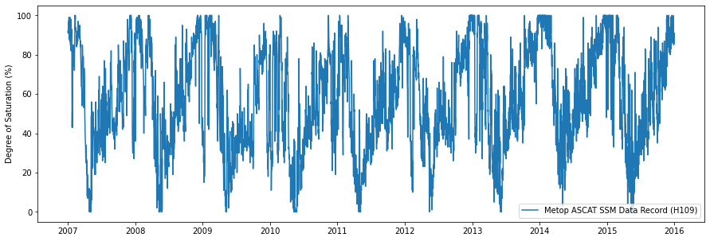
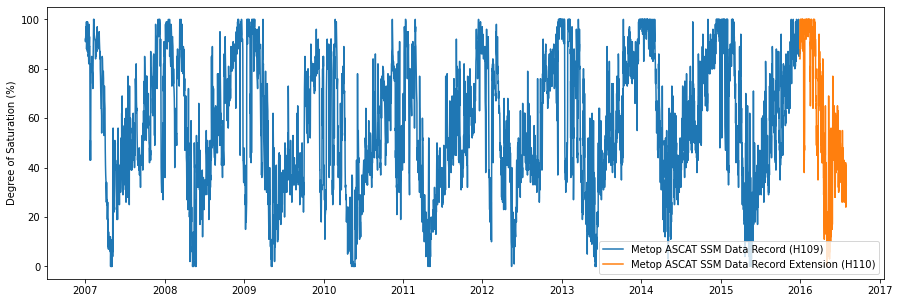
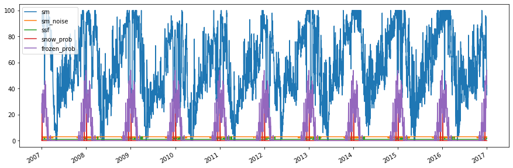
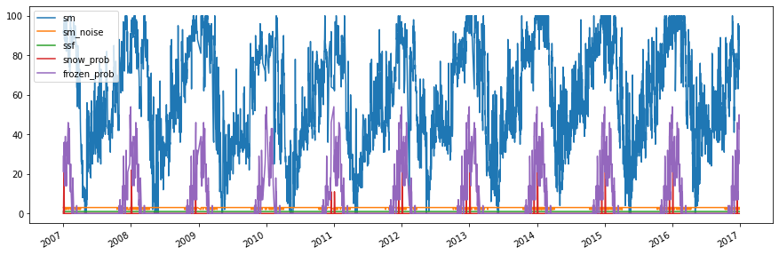
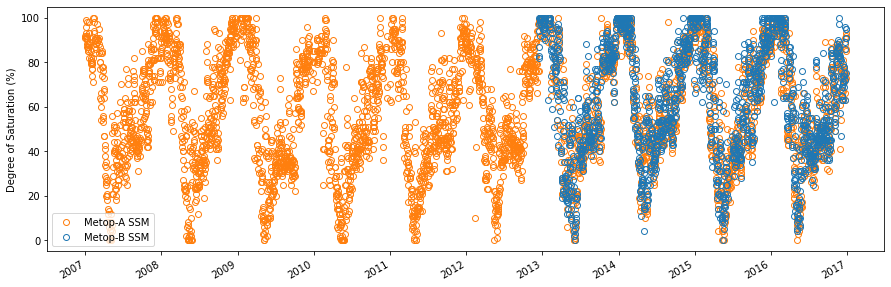
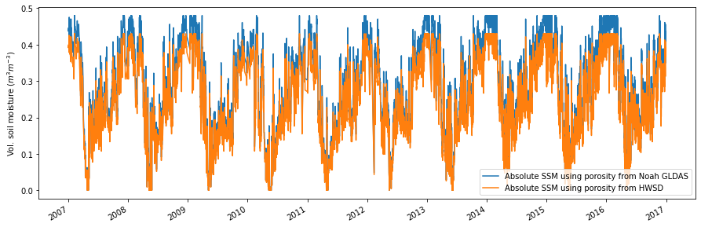

Example H SAF Metop ASCAT SSM DR products
-----------------------------------------

The following example shows how to read and plot H SAF Metop ASCAT SSM
data record products using the test data included in the ascat package.

.. code:: ipython3

    import os
    import matplotlib.pyplot as plt
    from ascat.h_saf import AscatSsmDataRecord

.. code:: ipython3

    test_data_path = os.path.join('..', 'tests','ascat_test_data', 'hsaf')
    h109_path = os.path.join(test_data_path, 'h109')
    h110_path = os.path.join(test_data_path, 'h110')
    h111_path = os.path.join(test_data_path, 'h111')
    grid_path = os.path.join(test_data_path, 'grid')
    static_layer_path = os.path.join(test_data_path, 'static_layer')
    
    h109_dr = AscatSsmDataRecord(h109_path, grid_path, static_layer_path=static_layer_path)
    h110_dr = AscatSsmDataRecord(h110_path, grid_path, static_layer_path=static_layer_path)
    h111_dr = AscatSsmDataRecord(h111_path, grid_path, static_layer_path=static_layer_path)

A soil moisture time series is read for a specific grid point. The
``data`` attribute contains a ``pandas.DataFrame`` object.

.. code:: ipython3

    gpi = 2501225
    h109_ts = h109_dr.read(gpi)

Time series plots
~~~~~~~~~~~~~~~~~

A simple time series plot of surface soil moisture can be created using
``matplotlib``.

.. code:: ipython3

    fig, ax = plt.subplots(1, 1, figsize=(15, 5))
    ax.plot(h109_ts['sm'], label='Metop ASCAT SSM Data Record (H109)')
    ax.set_ylabel('Degree of Saturation (%)')
    ax.legend()

.. parsed-literal::

    <matplotlib.legend.Legend at 0x7fb874034dd8>

The SSM data record H109 can be extended using H110, representing a
consistent continuation of the data set

.. code:: ipython3

    h110_ts = h110_dr.read(gpi)
    
    fig, ax = plt.subplots(1, 1, figsize=(15, 5))
    ax.plot(h109_ts['sm'], label='Metop ASCAT SSM Data Record (H109)')
    ax.plot(h110_ts['sm'], label='Metop ASCAT SSM Data Record Extension (H110)')
    ax.set_ylabel('Degree of Saturation (%)')
    ax.legend()

.. parsed-literal::

    <matplotlib.legend.Legend at 0x7fb86a725588>

A soil moisture time series can also be plotted using the plot function
provided by the ``pandas.DataFrame``. The following example displays
several variables stored in the time series.

.. code:: ipython3

    fields = ['sm', 'sm_noise', 'ssf', 'snow_prob', 'frozen_prob']
    h111_ts = h111_dr.read(gpi)
    
    fig, ax = plt.subplots(1, 1, figsize=(15, 5))
    h111_ts[fields].plot(ax=ax)
    ax.legend()

.. parsed-literal::

    <matplotlib.legend.Legend at 0x7fb86a6840f0>

Masking invalid soil moisture measurements
~~~~~~~~~~~~~~~~~~~~~~~~~~~~~~~~~~~~~~~~~~

In order to mask invalid/suspicious soil moisture measurements, the
confidence flag can be used. It masks soil moisture measurements with a
frozen or snow cover probability > 50% and using the Surface State Flag
(SSF).

.. code:: ipython3

    conf_flag_ok = h111_ts['conf_flag'] == 0
    
    fig, ax = plt.subplots(1, 1, figsize=(15, 5))
    h111_ts[conf_flag_ok][fields].plot(ax=ax)
    ax.legend()

.. parsed-literal::

    <matplotlib.legend.Legend at 0x7fb86a4afb00>

Differentiate between soil moisture from Metop satellites
~~~~~~~~~~~~~~~~~~~~~~~~~~~~~~~~~~~~~~~~~~~~~~~~~~~~~~~~~

The ``sat_id`` field can be used to differentiate between: Metop-A
(``sat_id``\ =3), Metop-B (``sat_id``\ =4) and Metop-C (``sat_id=5``).

.. code:: ipython3

    metop_a = h111_ts[conf_flag_ok]['sat_id'] == 3
    metop_b = h111_ts[conf_flag_ok]['sat_id'] == 4
    
    fig, ax = plt.subplots(1, 1, figsize=(15, 5))
    h111_ts[conf_flag_ok]['sm'][metop_a].plot(ax=ax, ls='none', marker='o', 
                                              color='C1', fillstyle='none', label='Metop-A SSM')
    h111_ts[conf_flag_ok]['sm'][metop_b].plot(ax=ax, ls='none', marker='o', 
                                              color='C0', fillstyle='none', label='Metop-B SSM')
    ax.set_ylabel('Degree of Saturation (%)')
    ax.legend()

.. parsed-literal::

    <matplotlib.legend.Legend at 0x7fb86a6e2a20>

Convert to absolute surface soil moisture
~~~~~~~~~~~~~~~~~~~~~~~~~~~~~~~~~~~~~~~~~

It is possible to convert relative surface soil moisture given in degree
of saturation into absolute soil moisture (:math:`m^3 m^{-3}`) using the
``absolute_sm`` keyword during reading. Porosity information provided by
`Noah GLDAS <https://ldas.gsfc.nasa.gov/gldas/GLDASsoils.php>`__ and
pre-computed porosity from the `Harmonized World Soil Database
(HWSD) <http://www.fao.org/soils-portal/soil-survey/soil-maps-and-databases/harmonized-world-soil-database-v12/en/>`__
using the formulas of `Saxton and Rawls
(2006) <https://dl.sciencesocieties.org/publications/sssaj/abstracts/70/5/1569>`__
is used to produce volumetric surface soil moisture expressed in
:math:`m^{3} m^{-3}`.

.. code:: ipython3

    h111_ts = h111_dr.read(gpi, absolute_sm=True)
    conf_flag_ok = h111_ts['conf_flag'] == 0
    
    fig, ax = plt.subplots(1, 1, figsize=(15, 5))
    h111_ts[conf_flag_ok]['abs_sm_gldas'].plot(ax=ax, label='Absolute SSM using porosity from Noah GLDAS')
    h111_ts[conf_flag_ok]['abs_sm_hwsd'].plot(ax=ax, label='Absolute SSM using porosity from HWSD')
    ax.set_ylabel('Vol. soil moisture ($m^3 m^{-3}$)')
    ax.legend()

.. parsed-literal::

    <matplotlib.legend.Legend at 0x7fb86a39be10>

