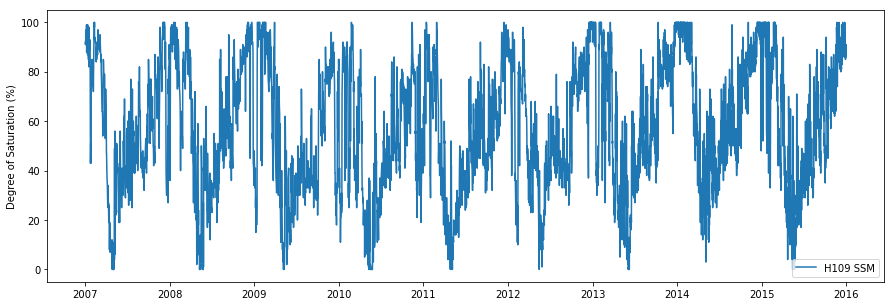
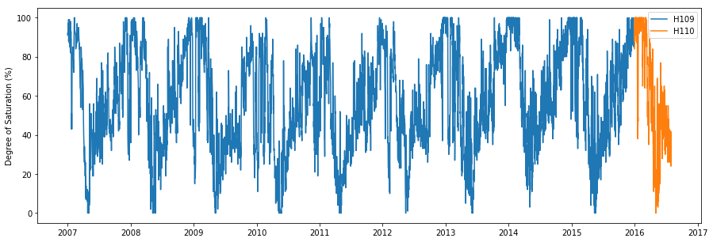
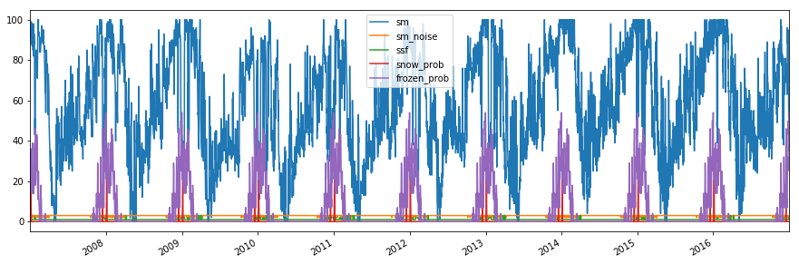
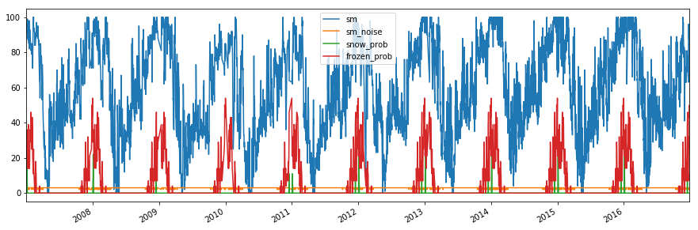
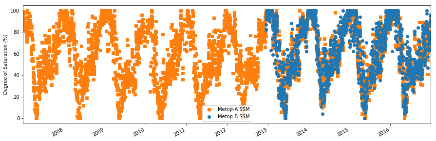
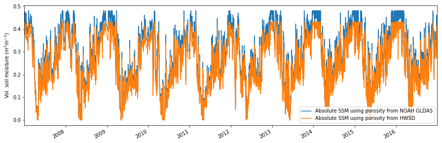

Example H SAF SSM CDR products
------------------------------

In this Example we will read and plot the H SAF SSM CDR products H109,
H110 and H111 using the test data included in the ascat package.

.. code:: ipython2

    import os
    import ascat.h_saf as h_saf
    
    test_data_path = os.path.join('..', 'tests','ascat_test_data', 'hsaf')
    h109_path = os.path.join(test_data_path, 'h109')
    h110_path = os.path.join(test_data_path, 'h110')
    h111_path = os.path.join(test_data_path, 'h111')
    grid_path = os.path.join(test_data_path, 'grid')
    static_layer_path = os.path.join(test_data_path, 'static_layer')
    
    h109_reader = h_saf.H109Ts(h109_path, grid_path, static_layer_path=static_layer_path)
    h110_reader = h_saf.H110Ts(h110_path, grid_path, static_layer_path=static_layer_path)
    h111_reader = h_saf.H111Ts(h111_path, grid_path, static_layer_path=static_layer_path)

A soil moisture time series is read for a specific grid point. The
``data`` attribute contains a ``pandas.DataFrame`` object.

.. code:: ipython2

    gpi = 2501225
    h109_ts = h109_reader.read(gpi)
    print(h109_ts.data)

.. parsed-literal::

                                corr_flag  dir  proc_flag  sat_id   sm  sm_noise  \
    2007-01-01 21:06:01.843200          0    0          0       3   92         3   
    2007-01-02 09:18:16.848000          0    1          0       3   91         3   
    2007-01-03 10:37:43.104000          0    1          0       3   93         3   
    2007-01-04 20:03:56.275200          0    0          0       3   91         3   
    2007-01-05 21:23:26.246400          0    0          0       3   97         3   
    2007-01-06 09:35:41.251200          0    1          0       3   92         3   
    2007-01-06 21:02:37.507200          0    0          0       3   99         3   
    2007-01-07 09:14:52.512000          0    1          0       3   88         3   
    2007-01-08 10:34:20.582400          0    1          0       3   91         3   
    2007-01-09 20:00:33.753600          0    0          0       3   92         3   
    2007-01-10 21:20:01.910400          0    0          0       3   90         3   
    2007-01-11 09:32:16.915200          0    1          0       3   87         3   
    2007-01-11 20:59:13.084800          0    0          0       3   99         3   
    2007-01-12 09:11:28.089600          0    1          0       3   87         3   
    2007-01-12 10:51:33.753600          0    1          0       3   87         3   
    2007-01-13 10:30:58.147200          0    1          0       3   87         3   
    2007-01-14 19:57:13.132800          0    0          0       3   85         3   
    2007-01-15 21:16:37.488000          0    0          0       3   85         3   
    2007-01-16 09:28:52.492800          0    1          0       3   86         3   
    2007-01-17 10:48:11.232000          0    1          0       3   82         3   
    2007-01-18 10:27:35.625600          0    1          0       3   98         3   
    2007-01-18 20:14:26.217600          0    0          0       3   93         2   
    2007-01-19 19:53:50.611200          0    0          0       3   89         3   
    2007-01-20 21:13:13.152000          0    0          0       3   93         3   
    2007-01-21 09:25:28.156800          0    1          0       3   89         3   
    2007-01-22 10:44:48.710400          0    1          0       3   89         3   
    2007-01-23 10:24:13.104000          0    1          0       3   46         3   
    2007-01-23 20:11:03.782400          0    0          0       3   43         3   
    2007-01-24 19:50:28.089600          0    0          0       3   51         3   
    2007-01-25 21:09:48.729600          0    0          0       3   43         3   
    ...                               ...  ...        ...     ...  ...       ...   
    2015-12-19 21:20:37.507200          0    0          0       4   97         3   
    2015-12-20 09:32:50.611200          0    1          0       4   88         3   
    2015-12-20 20:05:52.483200          0    0          0       3   90         3   
    2015-12-20 20:59:46.867200          0    0          0       4   97         3   
    2015-12-21 09:11:59.971200          0    1          0       4   89         3   
    2015-12-21 10:52:05.635200          0    1          0       4   86         3   
    2015-12-21 19:45:16.876800          0    0          0       3   89         3   
    2015-12-22 09:37:37.459200          0    1          0       3   90         2   
    2015-12-22 10:31:30.028800          0    1          0       4   90         3   
    2015-12-22 21:04:35.616000          0    0          0       3   87         3   
    2015-12-23 09:16:50.620800          0    1          0       3   89         3   
    2015-12-23 19:57:43.113600          0    0          0       4   90         3   
    2015-12-24 10:36:14.976000          0    1          0       3   89         3   
    2015-12-24 21:17:05.654400          2    0          0       4  100         3   
    2015-12-25 09:29:20.659200          2    1          0       4  100         3   
    2015-12-25 20:02:29.961600          0    0          0       3   94         3   
    2015-12-26 10:48:37.497600          0    1          0       4   90         3   
    2015-12-26 21:21:58.118400          0    0          0       3   91         3   
    2015-12-27 09:34:13.123200          0    1          0       3   86         3   
    2015-12-27 10:28:01.891200          0    1          0       4   88         3   
    2015-12-27 20:14:52.483200          0    0          0       4   86         2   
    2015-12-27 21:01:09.379200          0    0          0       3   88         3   
    2015-12-28 09:13:24.384000          0    1          0       3   85         3   
    2015-12-28 19:54:14.976000          0    0          0       4   88         3   
    2015-12-29 10:32:52.540800          0    1          0       3   86         3   
    2015-12-29 21:13:35.616000          0    0          0       4   90         3   
    2015-12-30 09:25:50.620800          0    1          0       4   88         3   
    2015-12-30 19:59:05.625600          0    0          0       3   86         3   
    2015-12-31 10:45:09.360000          0    1          0       4   91         3   
    2015-12-31 21:18:31.881600          0    0          0       3   89         3   
    
                                ssf  snow_prob  frozen_prob  abs_sm_gldas  \
    2007-01-01 21:06:01.843200    1          0           29           NaN   
    2007-01-02 09:18:16.848000    1          0           21           NaN   
    2007-01-03 10:37:43.104000    1         11           29           NaN   
    2007-01-04 20:03:56.275200    1         22           29           NaN   
    2007-01-05 21:23:26.246400    1         11           36           NaN   
    2007-01-06 09:35:41.251200    1          0           32           NaN   
    2007-01-06 21:02:37.507200    1          0           32           NaN   
    2007-01-07 09:14:52.512000    1          0           18           NaN   
    2007-01-08 10:34:20.582400    1          0           18           NaN   
    2007-01-09 20:00:33.753600    1          0           14           NaN   
    2007-01-10 21:20:01.910400    1          0           32           NaN   
    2007-01-11 09:32:16.915200    1          0           36           NaN   
    2007-01-11 20:59:13.084800    1          0           36           NaN   
    2007-01-12 09:11:28.089600    1          0           39           NaN   
    2007-01-12 10:51:33.753600    1          0           39           NaN   
    2007-01-13 10:30:58.147200    1          0           21           NaN   
    2007-01-14 19:57:13.132800    1          0           18           NaN   
    2007-01-15 21:16:37.488000    1          0           21           NaN   
    2007-01-16 09:28:52.492800    1          0           14           NaN   
    2007-01-17 10:48:11.232000    1          0           21           NaN   
    2007-01-18 10:27:35.625600    1          0           14           NaN   
    2007-01-18 20:14:26.217600    1          0           14           NaN   
    2007-01-19 19:53:50.611200    1          0           18           NaN   
    2007-01-20 21:13:13.152000    1          0           29           NaN   
    2007-01-21 09:25:28.156800    1          0           36           NaN   
    2007-01-22 10:44:48.710400    1          0           29           NaN   
    2007-01-23 10:24:13.104000    2          0           39           NaN   
    2007-01-23 20:11:03.782400    2          0           39           NaN   
    2007-01-24 19:50:28.089600    2          0           25           NaN   
    2007-01-25 21:09:48.729600    2          0           18           NaN   
    ...                         ...        ...          ...           ...   
    2015-12-19 21:20:37.507200    1          0            7           NaN   
    2015-12-20 09:32:50.611200    1          0           11           NaN   
    2015-12-20 20:05:52.483200    1          0           11           NaN   
    2015-12-20 20:59:46.867200    1          0           11           NaN   
    2015-12-21 09:11:59.971200    1          0            7           NaN   
    2015-12-21 10:52:05.635200    1          0            7           NaN   
    2015-12-21 19:45:16.876800    1          0            7           NaN   
    2015-12-22 09:37:37.459200    1          0            7           NaN   
    2015-12-22 10:31:30.028800    1          0            7           NaN   
    2015-12-22 21:04:35.616000    1          0            7           NaN   
    2015-12-23 09:16:50.620800    1          0           25           NaN   
    2015-12-23 19:57:43.113600    1          0           25           NaN   
    2015-12-24 10:36:14.976000    1          0           32           NaN   
    2015-12-24 21:17:05.654400    1          0           32           NaN   
    2015-12-25 09:29:20.659200    1          0           25           NaN   
    2015-12-25 20:02:29.961600    1          0           25           NaN   
    2015-12-26 10:48:37.497600    1          0           29           NaN   
    2015-12-26 21:21:58.118400    1          0           29           NaN   
    2015-12-27 09:34:13.123200    1          0           50           NaN   
    2015-12-27 10:28:01.891200    1          0           50           NaN   
    2015-12-27 20:14:52.483200    1          0           50           NaN   
    2015-12-27 21:01:09.379200    1          0           50           NaN   
    2015-12-28 09:13:24.384000    1          0           43           NaN   
    2015-12-28 19:54:14.976000    1          0           43           NaN   
    2015-12-29 10:32:52.540800    1          0           43           NaN   
    2015-12-29 21:13:35.616000    1          0           43           NaN   
    2015-12-30 09:25:50.620800    1          0           43           NaN   
    2015-12-30 19:59:05.625600    1          0           43           NaN   
    2015-12-31 10:45:09.360000    1          0           54           NaN   
    2015-12-31 21:18:31.881600    1          0           54           NaN   
    
                                abs_sm_noise_gldas  abs_sm_hwsd  abs_sm_noise_hwsd  
    2007-01-01 21:06:01.843200                 NaN          NaN                NaN  
    2007-01-02 09:18:16.848000                 NaN          NaN                NaN  
    2007-01-03 10:37:43.104000                 NaN          NaN                NaN  
    2007-01-04 20:03:56.275200                 NaN          NaN                NaN  
    2007-01-05 21:23:26.246400                 NaN          NaN                NaN  
    2007-01-06 09:35:41.251200                 NaN          NaN                NaN  
    2007-01-06 21:02:37.507200                 NaN          NaN                NaN  
    2007-01-07 09:14:52.512000                 NaN          NaN                NaN  
    2007-01-08 10:34:20.582400                 NaN          NaN                NaN  
    2007-01-09 20:00:33.753600                 NaN          NaN                NaN  
    2007-01-10 21:20:01.910400                 NaN          NaN                NaN  
    2007-01-11 09:32:16.915200                 NaN          NaN                NaN  
    2007-01-11 20:59:13.084800                 NaN          NaN                NaN  
    2007-01-12 09:11:28.089600                 NaN          NaN                NaN  
    2007-01-12 10:51:33.753600                 NaN          NaN                NaN  
    2007-01-13 10:30:58.147200                 NaN          NaN                NaN  
    2007-01-14 19:57:13.132800                 NaN          NaN                NaN  
    2007-01-15 21:16:37.488000                 NaN          NaN                NaN  
    2007-01-16 09:28:52.492800                 NaN          NaN                NaN  
    2007-01-17 10:48:11.232000                 NaN          NaN                NaN  
    2007-01-18 10:27:35.625600                 NaN          NaN                NaN  
    2007-01-18 20:14:26.217600                 NaN          NaN                NaN  
    2007-01-19 19:53:50.611200                 NaN          NaN                NaN  
    2007-01-20 21:13:13.152000                 NaN          NaN                NaN  
    2007-01-21 09:25:28.156800                 NaN          NaN                NaN  
    2007-01-22 10:44:48.710400                 NaN          NaN                NaN  
    2007-01-23 10:24:13.104000                 NaN          NaN                NaN  
    2007-01-23 20:11:03.782400                 NaN          NaN                NaN  
    2007-01-24 19:50:28.089600                 NaN          NaN                NaN  
    2007-01-25 21:09:48.729600                 NaN          NaN                NaN  
    ...                                        ...          ...                ...  
    2015-12-19 21:20:37.507200                 NaN          NaN                NaN  
    2015-12-20 09:32:50.611200                 NaN          NaN                NaN  
    2015-12-20 20:05:52.483200                 NaN          NaN                NaN  
    2015-12-20 20:59:46.867200                 NaN          NaN                NaN  
    2015-12-21 09:11:59.971200                 NaN          NaN                NaN  
    2015-12-21 10:52:05.635200                 NaN          NaN                NaN  
    2015-12-21 19:45:16.876800                 NaN          NaN                NaN  
    2015-12-22 09:37:37.459200                 NaN          NaN                NaN  
    2015-12-22 10:31:30.028800                 NaN          NaN                NaN  
    2015-12-22 21:04:35.616000                 NaN          NaN                NaN  
    2015-12-23 09:16:50.620800                 NaN          NaN                NaN  
    2015-12-23 19:57:43.113600                 NaN          NaN                NaN  
    2015-12-24 10:36:14.976000                 NaN          NaN                NaN  
    2015-12-24 21:17:05.654400                 NaN          NaN                NaN  
    2015-12-25 09:29:20.659200                 NaN          NaN                NaN  
    2015-12-25 20:02:29.961600                 NaN          NaN                NaN  
    2015-12-26 10:48:37.497600                 NaN          NaN                NaN  
    2015-12-26 21:21:58.118400                 NaN          NaN                NaN  
    2015-12-27 09:34:13.123200                 NaN          NaN                NaN  
    2015-12-27 10:28:01.891200                 NaN          NaN                NaN  
    2015-12-27 20:14:52.483200                 NaN          NaN                NaN  
    2015-12-27 21:01:09.379200                 NaN          NaN                NaN  
    2015-12-28 09:13:24.384000                 NaN          NaN                NaN  
    2015-12-28 19:54:14.976000                 NaN          NaN                NaN  
    2015-12-29 10:32:52.540800                 NaN          NaN                NaN  
    2015-12-29 21:13:35.616000                 NaN          NaN                NaN  
    2015-12-30 09:25:50.620800                 NaN          NaN                NaN  
    2015-12-30 19:59:05.625600                 NaN          NaN                NaN  
    2015-12-31 10:45:09.360000                 NaN          NaN                NaN  
    2015-12-31 21:18:31.881600                 NaN          NaN                NaN  
    
    [5194 rows x 13 columns]

Time series plots of grid points
~~~~~~~~~~~~~~~~~~~~~~~~~~~~~~~~

A simple time series plot of surface soil moisture can be created using
``matplotlib``.

.. code:: ipython2

    import matplotlib.pyplot as plt
    
    fig, ax = plt.subplots(1, 1, figsize=(15, 5))
    ax.plot(h109_ts.data.index, h109_ts.data['sm'], label='H109 SSM')
    ax.set_ylabel('Degree of Saturation (%)')
    ax.legend()
    plt.show()

The SSM CDR H109 can be extended using H110, representing a consistent
continuation of the data set

.. code:: ipython2

    h110_ts = h110_reader.read(gpi)
    
    fig, ax = plt.subplots(1, 1, figsize=(15, 5))
    ax.plot(h109_ts.data.index, h109_ts.data['sm'], label='H109')
    ax.plot(h110_ts.data.index, h110_ts.data['sm'], label='H110')
    ax.set_ylabel('Degree of Saturation (%)')
    ax.legend()
    plt.show()

A soil moisture time series can also be plotted using the plot function
provided by the ``pandas.DataFrame`` object stored in the ``.data``
attribute. The following example displays several variables stored in
the time series.

.. code:: ipython2

    h111_ts = h111_reader.read(gpi)
    
    fields = ['sm', 'sm_noise', 'ssf', 'snow_prob', 'frozen_prob']
    
    fig, ax = plt.subplots(1, 1, figsize=(15, 5))
    h111_ts.data[fields].plot(ax=ax)
    ax.legend()
    plt.show()

Masking invalid soil moisture measurements
~~~~~~~~~~~~~~~~~~~~~~~~~~~~~~~~~~~~~~~~~~

In order to mask invalid/suspicious soil moisture measurements, the
confidence flag can be used. It masks soil moisture measurements with a
frozen or snow cover probability > 50% and using th eSurface State Flag
(SSF) information.

.. code:: ipython2

    conf_flag_ok = h111_ts.data['conf_flag'] == 0
    
    fig, ax = plt.subplots(1, 1, figsize=(15, 5))
    h111_ts.data[conf_flag_ok][fields].plot(ax=ax)
    ax.legend()
    plt.show()

Differentiate between Metop-A and Metop-B soil moisture
~~~~~~~~~~~~~~~~~~~~~~~~~~~~~~~~~~~~~~~~~~~~~~~~~~~~~~~

The ``sat_id`` field can be used to differentiate between Metop-A
(``sat_id``\ =3) and Metop-B (``sat_id``\ =4) measurements.

.. code:: ipython2

    metop_a = h111_ts.data[conf_flag_ok]['sat_id'] == 3
    metop_b = h111_ts.data[conf_flag_ok]['sat_id'] == 4
    
    fig, ax = plt.subplots(1, 1, figsize=(15, 5))
    h111_ts.data[conf_flag_ok]['sm'][metop_a].plot(ax=ax, ls='none', marker='s', color='C1', label='Metop-A SSM')
    h111_ts.data[conf_flag_ok]['sm'][metop_b].plot(ax=ax, ls='none', marker='o', color='C0', label='Metop-B SSM')
    ax.set_ylabel('Degree of Saturation (%)')
    ax.legend()
    plt.show()

Convert to absolute surface soil moisture
~~~~~~~~~~~~~~~~~~~~~~~~~~~~~~~~~~~~~~~~~

It is possible to convert relative surface soil moisture given in degree
of saturation into absolute soil moisture (:math:`m^3 m^{-3}`) using the
``absolute_sm`` keyword during reading. Porosity information provided by
`NOAH GLDAS <https://ldas.gsfc.nasa.gov/gldas/GLDASsoils.php>`__ and
pre-computed porosity from the `Harmonized World Soil Database
(HWSD) <http://www.fao.org/soils-portal/soil-survey/soil-maps-and-databases/harmonized-world-soil-database-v12/en/>`__
using the formulas of `Saxton and Rawls
(2006) <https://dl.sciencesocieties.org/publications/sssaj/abstracts/70/5/1569>`__
is used to produce volumetric surface soil moisture expressed in
:math:`m^{3} m^{-3}`.

.. code:: ipython2

    h111_ts = h111_reader.read(gpi, absolute_sm=True)
    conf_flag_ok = h111_ts.data['conf_flag'] == 0
    
    fig, ax = plt.subplots(1, 1, figsize=(15, 5))
    h111_ts.data[conf_flag_ok]['abs_sm_gldas'].plot(ax=ax, label='Absolute SSM using porosity from NOAH GLDAS')
    h111_ts.data[conf_flag_ok]['abs_sm_hwsd'].plot(ax=ax, label='Absolute SSM using porosity from HWSD')
    ax.set_ylabel('Vol. soil moisture ($m^3 m^{-3}$)')
    ax.legend()
    plt.show()

