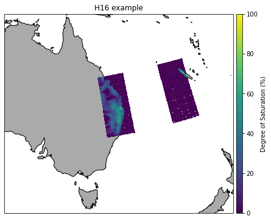

Example H SAF SM NRT products
-----------------------------

In this Example we will read and plot images of the H SAF NRT products
H08, H14 and H16 using the test images included in the ascat package.

.. code:: ipython3

    import os
    from datetime import datetime
    import numpy as np
    import cartopy
    import matplotlib.pyplot as plt
    from pytesmo.grid.resample import resample_to_grid
    %matplotlib inline
    
    from ascat.h_saf import H08BufrFileList
    from ascat.h_saf import H14GribFileList
    from ascat.h_saf import AscatNrtBufrFileList

.. parsed-literal::

    /home/shahn/conda/ascat_conda/envs/ascat_env/lib/python3.6/site-packages/pyresample/bilinear/__init__.py:49: UserWarning: XArray and/or zarr not found, XArrayBilinearResampler won't be available.
      warnings.warn("XArray and/or zarr not found, XArrayBilinearResampler won't be available.")
    /home/shahn/conda/ascat_conda/envs/ascat_env/lib/python3.6/site-packages/pytesmo/grid/resample.py:30: UserWarning: resampling functions have moved to the repurpose package and will beremoved from pytesmo soon!
      warn("resampling functions have moved to the repurpose package and will be"

.. code:: ipython3

    test_data_path = os.path.join('..', 'tests','ascat_test_data', 'hsaf')

Disaggregated ASCAT SSM NRT (H08)
~~~~~~~~~~~~~~~~~~~~~~~~~~~~~~~~~

H08 data has a much higher resolution and comes on a 0.00416 degree
grid. The sample data included in the ascat package was observed on the
same time as the included H16 product.

.. code:: ipython3

    h08_path = os.path.join(test_data_path, 'h08')
    h08_nrt = H08BufrFileList(h08_path)
    h08_data = h08_nrt.read(datetime(2010, 5, 1, 8, 33, 1))
    h08_data

.. parsed-literal::

    {'ssm': array([[1.69999998e+38, 1.69999998e+38, 1.69999998e+38, ...,
             1.69999998e+38, 1.69999998e+38, 1.69999998e+38],
            [1.69999998e+38, 1.69999998e+38, 1.69999998e+38, ...,
             1.69999998e+38, 1.69999998e+38, 1.69999998e+38],
            [1.69999998e+38, 1.69999998e+38, 1.69999998e+38, ...,
             1.69999998e+38, 1.69999998e+38, 1.69999998e+38],
            ...,
            [1.69999998e+38, 1.69999998e+38, 1.69999998e+38, ...,
             1.69999998e+38, 1.69999998e+38, 1.69999998e+38],
            [1.69999998e+38, 1.69999998e+38, 1.69999998e+38, ...,
             1.69999998e+38, 1.69999998e+38, 1.69999998e+38],
            [1.69999998e+38, 1.69999998e+38, 1.69999998e+38, ...,
             1.69999998e+38, 1.69999998e+38, 1.69999998e+38]]),
     'ssm_noise': array([[1.69999998e+38, 1.69999998e+38, 1.69999998e+38, ...,
             1.69999998e+38, 1.69999998e+38, 1.69999998e+38],
            [1.69999998e+38, 1.69999998e+38, 1.69999998e+38, ...,
             1.69999998e+38, 1.69999998e+38, 1.69999998e+38],
            [1.69999998e+38, 1.69999998e+38, 1.69999998e+38, ...,
             1.69999998e+38, 1.69999998e+38, 1.69999998e+38],
            ...,
            [1.69999998e+38, 1.69999998e+38, 1.69999998e+38, ...,
             1.69999998e+38, 1.69999998e+38, 1.69999998e+38],
            [1.69999998e+38, 1.69999998e+38, 1.69999998e+38, ...,
             1.69999998e+38, 1.69999998e+38, 1.69999998e+38],
            [1.69999998e+38, 1.69999998e+38, 1.69999998e+38, ...,
             1.69999998e+38, 1.69999998e+38, 1.69999998e+38]]),
     'proc_flag': array([[1.69999998e+38, 1.69999998e+38, 1.69999998e+38, ...,
             1.69999998e+38, 1.69999998e+38, 1.69999998e+38],
            [1.69999998e+38, 1.69999998e+38, 1.69999998e+38, ...,
             1.69999998e+38, 1.69999998e+38, 1.69999998e+38],
            [1.69999998e+38, 1.69999998e+38, 1.69999998e+38, ...,
             1.69999998e+38, 1.69999998e+38, 1.69999998e+38],
            ...,
            [1.69999998e+38, 1.69999998e+38, 1.69999998e+38, ...,
             1.69999998e+38, 1.69999998e+38, 1.69999998e+38],
            [1.69999998e+38, 1.69999998e+38, 1.69999998e+38, ...,
             1.69999998e+38, 1.69999998e+38, 1.69999998e+38],
            [1.69999998e+38, 1.69999998e+38, 1.69999998e+38, ...,
             1.69999998e+38, 1.69999998e+38, 1.69999998e+38]]),
     'corr_flag': array([[0., 0., 0., ..., 0., 0., 0.],
            [0., 0., 0., ..., 0., 0., 0.],
            [0., 0., 0., ..., 0., 0., 0.],
            ...,
            [0., 0., 0., ..., 0., 0., 0.],
            [0., 0., 0., ..., 0., 0., 0.],
            [0., 0., 0., ..., 0., 0., 0.]]),
     'lon': array([[13.00208, 13.00625, 13.01042, ..., 44.98958, 44.99375, 44.99792],
            [13.00208, 13.00625, 13.01042, ..., 44.98958, 44.99375, 44.99792],
            [13.00208, 13.00625, 13.01042, ..., 44.98958, 44.99375, 44.99792],
            ...,
            [13.00208, 13.00625, 13.01042, ..., 44.98958, 44.99375, 44.99792],
            [13.00208, 13.00625, 13.01042, ..., 44.98958, 44.99375, 44.99792],
            [13.00208, 13.00625, 13.01042, ..., 44.98958, 44.99375, 44.99792]]),
     'lat': array([[70.99792   , 70.99792   , 70.99792   , ..., 70.99792   ,
             70.99792   , 70.99792   ],
            [70.99375333, 70.99375333, 70.99375333, ..., 70.99375333,
             70.99375333, 70.99375333],
            [70.98958666, 70.98958666, 70.98958666, ..., 70.98958666,
             70.98958666, 70.98958666],
            ...,
            [58.01041334, 58.01041334, 58.01041334, ..., 58.01041334,
             58.01041334, 58.01041334],
            [58.00624667, 58.00624667, 58.00624667, ..., 58.00624667,
             58.00624667, 58.00624667],
            [58.00208   , 58.00208   , 58.00208   , ..., 58.00208   ,
             58.00208   , 58.00208   ]])}

.. code:: ipython3

    plot_crs = cartopy.crs.Mercator()
    data_crs = cartopy.crs.PlateCarree()
    
    fig = plt.figure(figsize=(12, 10))
    ax = fig.add_subplot(1, 1, 1, projection=plot_crs)
    ax.set_title('H08 example')
    
    ax.add_feature(cartopy.feature.COASTLINE, linestyle='-')
    ax.add_feature(cartopy.feature.BORDERS, linestyle=':')
    ax.add_feature(cartopy.feature.LAND, facecolor='#aaaaaa')
    ax.set_extent([5, 50, 50, 70])
    
    ssm = np.ma.masked_greater(np.flipud(h08_data['ssm']), 100)
    sc = ax.pcolormesh(h08_data['lon'], np.flipud(h08_data['lat']), ssm, zorder=3, 
                       transform=data_crs, vmin=0, vmax=100)
    
    cax = fig.add_axes([ax.get_position().x1+0.01, ax.get_position().y0,
                        0.02, ax.get_position().height])
    
    cbar = fig.colorbar(sc, ax=ax, cax=cax)
    cbar.set_label('Degree of Saturation (%)')

.. image:: read_hsaf_nrt_files/read_hsaf_nrt_7_0.png

SM-DAS-2 (H14)
~~~~~~~~~~~~~~

The SM-DAS-2 (H14) product is a global product on a reduced gaussian
grid with a resolution of approx. 25km.

.. code:: ipython3

    h14_path = os.path.join(test_data_path, 'h14')
    h14_nrt = H14GribFileList(h14_path)
    h14_data = h14_nrt.read(datetime(2014, 5, 15))
    
    # the data is a dictionary, each dictionary key contains the array of one variable
    print("The following variables are in this image", h14_data.keys())
    print(h14_data['SM_layer1_0-7cm'].shape)
    print(h14_data['lon'].shape, h14_data['lat'].shape)

.. parsed-literal::

    The following variables are in this image dict_keys(['SM_layer1_0-7cm', 'lat', 'lon', 'SM_layer2_7-28cm', 'SM_layer3_28-100cm', 'SM_layer4_100-289cm'])
    (800, 1600)
    (800, 1600) (800, 1600)

Let’s plot all layers in the H14 product

.. code:: ipython3

    plot_crs = cartopy.crs.Robinson()
    data_crs = cartopy.crs.PlateCarree()
    
    layers = ['SM_layer1_0-7cm', 'SM_layer2_7-28cm', 
              'SM_layer3_28-100cm', 'SM_layer4_100-289cm']
    
    for layer in layers:
        fig = plt.figure(figsize=(12, 6))
        ax = fig.add_subplot(1, 1, 1, projection=plot_crs)
        ax.set_title('H14 {:}'.format(layer))
    
        ax.add_feature(cartopy.feature.COASTLINE, linestyle='-')
        ax.add_feature(cartopy.feature.BORDERS, linestyle=':')
        ax.add_feature(cartopy.feature.LAND, facecolor='#aaaaaa')
    
        sc = ax.pcolormesh(h14_data['lon'], h14_data['lat'], h14_data[layer], zorder=3, 
                           transform=data_crs)
    
        cax = fig.add_axes([ax.get_position().x1+0.01, ax.get_position().y0,
                        0.02, ax.get_position().height])
    
        cbar = fig.colorbar(sc, ax=ax, cax=cax)
        cbar.set_label('Liquid Root Zone Soil Moisture')

.. image:: read_hsaf_nrt_files/read_hsaf_nrt_12_3.png

ASCAT SSM NRT (H16, H101, H102, H103)
~~~~~~~~~~~~~~~~~~~~~~~~~~~~~~~~~~~~~

The products H16, H101, H102, H103 come in the same BUFR format and the
default filenames are slightly different.

.. code:: ipython3

    h16_path = os.path.join(test_data_path, 'h16')
    h16_nrt = AscatNrtBufrFileList(h16_path)
    h16_data = h16_nrt.read(datetime(2017, 2, 20, 11, 15, 0))
    
    print(h16_data['sm'].shape, h16_data['lon'].shape, h16_data['lat'].shape)

.. parsed-literal::

    (2016,) (2016,) (2016,)

.. code:: ipython3

    plot_crs = cartopy.crs.Mercator()
    data_crs = cartopy.crs.PlateCarree()
    
    fig = plt.figure(figsize=(7, 6))
    ax = fig.add_subplot(1, 1, 1, projection=plot_crs)
    ax.set_title('H16 example')
    
    ax.add_feature(cartopy.feature.COASTLINE, linestyle='-')
    ax.add_feature(cartopy.feature.BORDERS, linestyle=':')
    ax.add_feature(cartopy.feature.LAND, facecolor='#aaaaaa')
    ax.set_extent([130, 175, -10, -42])
    
    sc = ax.scatter(h16_data['lon'], h16_data['lat'], 
                    c=h16_data['sm'], zorder=3, marker='s', s=2,
                    transform=data_crs, vmin=0, vmax=100)
    
    cax = fig.add_axes([ax.get_position().x1+0.01, ax.get_position().y0,
                        0.02, ax.get_position().height])
    cbar = fig.colorbar(sc, ax=ax, cax=cax)
    cbar.set_label('Degree of Saturation (%)')

Or resample orbit geometry to a regular 0.1 deg x 0.1 deg grid for
plotting

.. code:: ipython3

    # lets resample to a 0.1 degree grid
    # define the grid points in latitude and logitude
    lats_dim = np.arange(-80, 80, 0.1)
    lons_dim = np.arange(-160, 170, 0.1)
    
    # make 2d grid out the 1D grid spacings
    lons_grid, lats_grid = np.meshgrid(lons_dim, lats_dim)
        
    resampled_data = resample_to_grid({'sm': h16_data['sm']}, h16_data['lon'], 
                                      h16_data['lat'], lons_grid, lats_grid)
    
    fig = plt.figure(figsize=(7, 6))
    ax = fig.add_subplot(1, 1, 1, projection=plot_crs)
    ax.set_title('H16 example - Resampled to 0.1 x 0.1 grid')
    
    ax.add_feature(cartopy.feature.COASTLINE, linestyle='-')
    ax.add_feature(cartopy.feature.BORDERS, linestyle=':')
    ax.add_feature(cartopy.feature.LAND, facecolor='#aaaaaa')
    ax.set_extent([130, 175, -10, -42])
    
    sc = ax.pcolormesh(lons_grid, lats_grid, resampled_data['sm'], zorder=3, 
                       vmin=0, vmax=100, transform=data_crs)
    
    cax = fig.add_axes([ax.get_position().x1+0.01, ax.get_position().y0,
                        0.02, ax.get_position().height])
    cbar = fig.colorbar(sc, ax=ax, cax=cax)
    cbar.set_label('Degree of Saturation (%)')

