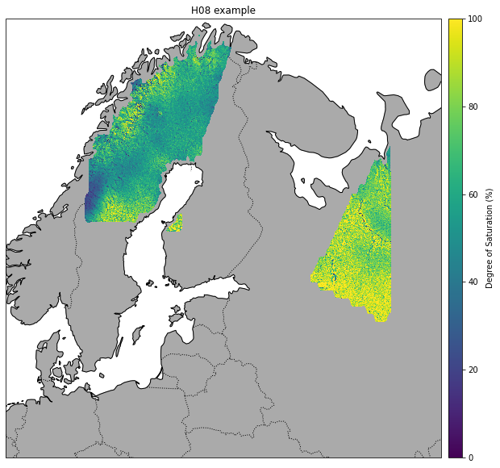

Example H SAF NRT SSM products
------------------------------

In this Example we will read and plot images of the H SAF NRT products
H08, H14 and H16 using the test images included in the ascat package.

.. code:: ipython2

    import os
    from datetime import datetime
    
    import pytesmo.colormaps.load_cmap as smcolormaps
    import ascat.h_saf as h_saf
    
    test_data_path = os.path.join('..', 'tests','ascat_test_data', 'hsaf')
    
    h08_path = os.path.join(test_data_path, 'h08')
    h14_path = os.path.join(test_data_path, 'h14')
    h16_path = os.path.join(test_data_path, 'h16')
    
    h08_reader = h_saf.H08img(h08_path)
    h14_reader = h_saf.H14img(h14_path)
    h16_reader = h_saf.H16img(h16_path, month_path_str='')

Reading H08 product
~~~~~~~~~~~~~~~~~~~

H08 data has a much higher resolution and comes on a 0.00416 degree
grid.

The sample data included in the ascat package was observed on the same
time as the included H16 product.

Instead of read you can also use the daily\_images iterator.

You just specify a day and it will read all the images that are in your
folder for this day.

This also works for the H16, H101, H102, H103 and H14 reader.

.. code:: ipython2

    for h08_data, metadata, timestamp, lons, lats, time_var in h08_reader.daily_images(datetime(2010, 5, 1)):
    
        # this tells you the exact timestamp of the read image
        print(timestamp.isoformat())
        print(type(h08_data))
        
        # the data is a dictionary, each dictionary key contains the array of one variable
        print("The following variables are in this image", h08_data.keys())
        print(h08_data['ssm'].shape)
        print(lons.shape)
        print(lats.shape)

.. parsed-literal::

    2010-05-01T08:33:01
    <type 'dict'>
    ('The following variables are in this image', ['ssm', 'proc_flag', 'ssm_noise', 'corr_flag'])
    (3120, 7680)
    (3120, 7680)
    (3120, 7680)

In our case only one image is in the folder so the loop exits after this
image is read.

The data has higher resolution but it already comes as a 2D image.

Let's plot it.

.. code:: ipython2

    import numpy as np
    import cartopy
    import matplotlib.pyplot as plt
    %matplotlib inline
    
    plot_crs = cartopy.crs.Mercator()
    data_crs = cartopy.crs.PlateCarree()
    
    
    fig = plt.figure(figsize=(8, 10))
    ax = fig.add_axes([0.05, 0.2, 0.6, 0.7], projection=plot_crs)
    
    ax.set_title('H08 example')
    
    blue = '#4b92db'
    ax.background_patch.set_facecolor(blue)
    ax.add_feature(cartopy.feature.GSHHSFeature(scale='low', facecolor='#efefdb'))
    ax.add_feature(cartopy.feature.BORDERS, linestyle=':')
    ax.add_feature(cartopy.feature.LAKES)
    ax.add_feature(cartopy.feature.RIVERS)
    
    ax.set_extent([10, 47, 50, 75])
    
    data = np.ma.masked_greater(np.flipud(h08_data['ssm']), 100)
    sc = ax.pcolormesh(lons, np.flipud(lats), data, zorder=3, 
                       transform=data_crs, cmap=smcolormaps.load('SWI_ASCAT'),
                      vmin=0, vmax=100)
    
    cax = fig.add_axes([0.65, 0.2, 0.025, 0.7])
    cbar = fig.colorbar(sc, cax=cax)
    cbar.set_label('Degree of Saturation (%)')
    plt.show()

Reading a Region Of Interest (ROI) of H08
^^^^^^^^^^^^^^^^^^^^^^^^^^^^^^^^^^^^^^^^^

H08 has a very high resolution and users might want to read only data
for their area of interest. This can be done using the lat\_lon\_bbox
keyword

.. code:: ipython2

    # the reader returns not only the data but also metadata and the longitudes and latitudes
    h08_roi, metadata, timestamp, lons, lats, time_var = \
        h08_reader.read(datetime(2010, 5, 1, 8, 33, 1), lat_lon_bbox=[60, 70, 15, 25])
    
    plot_crs = cartopy.crs.Mercator()
    data_crs = cartopy.crs.PlateCarree()
    
    fig = plt.figure(figsize=(8, 10))
    ax = fig.add_axes([0.05, 0.2, 0.6, 0.7], projection=plot_crs)
    # initialize the readers with the path
    ax.set_title('H08 ROI example')
        
    blue = '#4b92db'
    ax.background_patch.set_facecolor(blue)
    ax.add_feature(cartopy.feature.GSHHSFeature(scale='low', facecolor='#efefdb'))
    ax.add_feature(cartopy.feature.BORDERS, linestyle=':')
    ax.add_feature(cartopy.feature.LAKES)
    ax.add_feature(cartopy.feature.RIVERS)
    
    ax.set_extent([10, 47, 50, 75])
    
    data = np.ma.masked_greater(np.flipud(h08_roi['ssm']), 100)
    sc = ax.pcolormesh(lons, np.flipud(lats), data, zorder=3, 
                       transform=data_crs, cmap=smcolormaps.load('SWI_ASCAT'), 
                       vmin=0, vmax=100)
    
    cax = fig.add_axes([0.65, 0.2, 0.025, 0.7])
    cbar = fig.colorbar(sc, cax=cax)
    cbar.set_label('Degree of Saturation (%)')
    plt.show()

.. image:: read_hsaf_nrt_files/read_hsaf_nrt_10_0.png

Reading H14 product
~~~~~~~~~~~~~~~~~~~

The H14 product is a global product on a reduced gaussian grid with a
resolution of approx. 25km.

.. code:: ipython2

    # the reader returns not only the data but also metadata and the longitudes and latitudes
    h14_data, metadata, timestamp, lons, lats, time_var = h14_reader.read(datetime(2014, 5, 15))
    
    print(type(h14_data))
    
    # the data is a dictionary, each dictionary key contains the array of one variable
    print("The following variables are in this image", h14_data.keys())
    print(h14_data['SM_layer1_0-7cm'].shape)
    print(lons.shape)
    print(lats.shape)

.. parsed-literal::

    <type 'dict'>
    ('The following variables are in this image', ['SM_layer1_0-7cm', 'SM_layer2_7-28cm', 'SM_layer3_28-100cm', 'SM_layer4_100-289cm'])
    (800, 1600)
    (800, 1600)
    (800, 1600)

The data comes as a 2D array. If the keyword expand\_grid is set to
False during reader initialization then only 1D arrays would be
returned.

This can be good for working with the data but for plotting the expanded
grid is easier to handle.

Let's plot all layers in the H14 product

.. code:: ipython2

    plot_crs = cartopy.crs.Robinson()
    data_crs = cartopy.crs.PlateCarree()
    
    for layer in h14_data:
        fig = plt.figure(figsize=(12, 6))
        ax = fig.add_axes([0.1, 0.1, 0.8, 0.8], projection=plot_crs)
        ax.set_title('H14 {:}'.format(layer))
        
        ax.add_feature(cartopy.feature.LAND)
        ax.add_feature(cartopy.feature.OCEAN)
        ax.add_feature(cartopy.feature.COASTLINE)
        ax.add_feature(cartopy.feature.BORDERS, linestyle=':')
        ax.add_feature(cartopy.feature.LAKES, alpha=0.5)
        ax.add_feature(cartopy.feature.RIVERS)
    
        sc = ax.pcolormesh(lons, lats, h14_data[layer], zorder=3, 
                           transform=data_crs, cmap=smcolormaps.load('SWI_ASCAT'))
    
        cax = fig.add_axes([0.92, 0.1, 0.025, 0.8])
        cbar = fig.colorbar(sc, cax=cax)
        cbar.set_label('Liquid Root Zone Soil Moister')
        plt.show()

.. image:: read_hsaf_nrt_files/read_hsaf_nrt_16_0.png

.. image:: read_hsaf_nrt_files/read_hsaf_nrt_16_1.png

.. image:: read_hsaf_nrt_files/read_hsaf_nrt_16_2.png

.. image:: read_hsaf_nrt_files/read_hsaf_nrt_16_3.png

Reading H16 product
~~~~~~~~~~~~~~~~~~~

The products H16, H101, H102, H103 come in the same BUFR format. Since
the default filenames are slightly different the following readers
should be used:

-  H16 - ascat.h\_saf.H16img
-  H101 - ascat.h\_saf.H101img
-  H102 - ascat.h\_saf.H102img
-  H103 - ascat.h\_saf.H103img
-  H07 - ascat.h\_saf.H07img - discontinued product

Otherwise the format and API is identical.

The ascat repository includes one H16 file with the timestamp 2017-02-20
11:00:00. We can either read this file alone if we know the exact
timestamp or iterate over all images on 2017-02-20.

.. code:: ipython2

    # the reader returns not only the data but also metadata, longitudes and latitudes
    h16_data, metadata, timestamp, lons, lats, time_var = h16_reader.read(datetime(2017, 2, 20, 11, 15, 0))
    
    print(type(h16_data))
    
    # the data is a dictionary, each dictionary key contains the array of one variable
    print("The following variables are in this image", h16_data.keys())
    print h16_data['Surface Soil Moisture (Ms)'].shape
    
    # it is only a 1D array to plot the data we also need latitude and logitude information
    print(lons.shape)
    print(lats.shape)

.. parsed-literal::

    <type 'dict'>
    ('The following variables are in this image', ['Estimated Error In Sigma0 At 40 Deg Incidence Angle', 'Slope At 40 Deg Incidence Angle', 'Topographic Complexity', 'Surface Soil Moisture (Ms)', 'Inundation And Wetland Fraction', 'Wet Backscatter', 'Snow Cover', 'Rain Fall Detection', 'Frozen Land Surface Fraction', 'Mean Surface Soil Moisture', 'Estimated Error In Slope At 40 Deg Incidence Angle', 'Soil Moisture Sensitivity', 'Soil Moisture Processing Flag', 'jd', 'Dry Backscatter', 'Soil Moisture Correction Flag', 'Soil Moisture Quality', 'Orbit Number', 'Estimated Error In Surface Soil Moisture', 'Backscatter', 'Direction Of Motion Of Moving Observing Platform'])
    (637,)
    (637,)
    (637,)

Plot the SSM data as individual points

.. code:: ipython2

    plot_crs = cartopy.crs.Mercator()
    data_crs = cartopy.crs.PlateCarree()
    
    fig = plt.figure(figsize=(7, 6))
    ax = fig.add_axes([0.1, 0.1, 0.8, 0.8], projection=plot_crs)
    ax.set_title('H16 example - Original data')
       
    blue = '#4b92db'
    ax.background_patch.set_facecolor(blue)
    ax.add_feature(cartopy.feature.GSHHSFeature(scale='low', facecolor='#efefdb'))
    ax.add_feature(cartopy.feature.BORDERS, linestyle=':')
    ax.add_feature(cartopy.feature.LAKES, alpha=0.5)
    ax.add_feature(cartopy.feature.RIVERS)
    ax.set_extent([130, 175, -10, -42])
    
    data = h16_data['Surface Soil Moisture (Ms)']
    
    sc = ax.scatter(lons, lats, c=data, zorder=3, marker='s', s=2,
                    transform=data_crs, cmap=smcolormaps.load('SWI_ASCAT'),
                    vmin=0, vmax=100)
    
    cax = fig.add_axes([0.92, 0.1, 0.025, 0.8])
    cbar = fig.colorbar(sc, cax=cax)
    cbar.set_label('Degree of Saturation (%)')
    plt.show()

.. image:: read_hsaf_nrt_files/read_hsaf_nrt_21_0.png

Or resample orbit geometry to a regular 0.1 deg x 0.1 deg grid for
plotting

.. code:: ipython2

    import pytesmo.grid.resample as resample
    
    # lets resample to a 0.1 degree grid
    # define the grid points in latitude and logitude
    lats_dim = np.arange(-80, 80, 0.1)
    lons_dim = np.arange(-160, 170, 0.1)
    
    # make 2d grid out the 1D grid spacings
    lons_grid, lats_grid = np.meshgrid(lons_dim, lats_dim)
        
    resampled_data = resample.resample_to_grid(h16_data, lons, lats, 
                                               lons_grid, lats_grid)
    
    fig = plt.figure(figsize=(7, 6))
    ax = fig.add_axes([0.1, 0.1, 0.8, 0.8], projection=plot_crs)
    ax.set_title('H16 example - Resampled to 0.1 x 0.1 grid')
       
    blue = '#4b92db'
    ax.background_patch.set_facecolor(blue)
    ax.add_feature(cartopy.feature.GSHHSFeature(scale='low', facecolor='#efefdb'))
    ax.add_feature(cartopy.feature.BORDERS, linestyle=':')
    ax.add_feature(cartopy.feature.LAKES, alpha=0.5)
    ax.add_feature(cartopy.feature.RIVERS)
    ax.set_extent([130, 175, -10, -42])
    
    data = resampled_data['Surface Soil Moisture (Ms)']
    sc = ax.pcolormesh(lons_grid, lats_grid, data, zorder=3, 
                       cmap=smcolormaps.load('SWI_ASCAT'),
                       vmin=0, vmax=100, transform=data_crs)
    
    cax = fig.add_axes([0.92, 0.1, 0.025, 0.8])
    cbar = fig.colorbar(sc, cax=cax)
    cbar.set_label('Degree of Saturation (%)')
    plt.show()

.. image:: read_hsaf_nrt_files/read_hsaf_nrt_23_0.png

