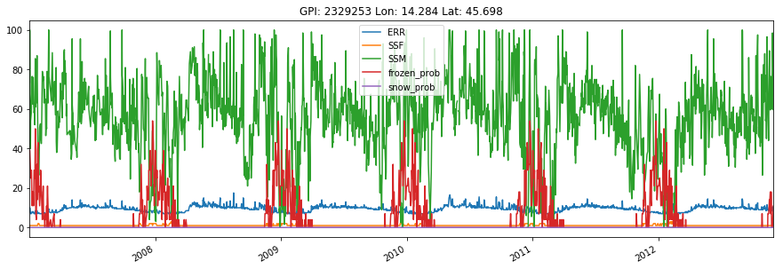
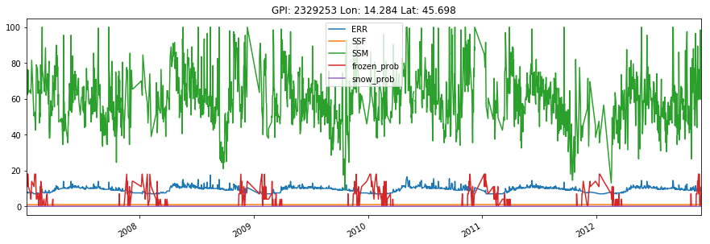
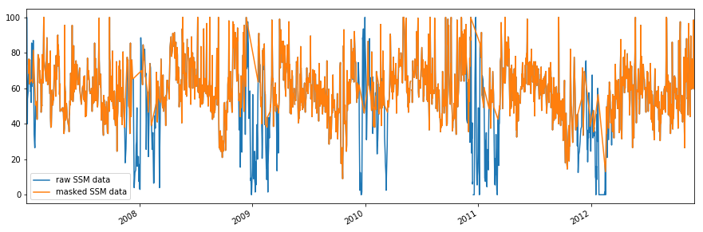

Example TU Wien Soil Moisture time series
-----------------------------------------

In this Example we will read and plot TU Wien soil moisture time series
using the test data included in the ascat package.

.. code:: ipython2

    import os
    import matplotlib.pyplot as plt
    import ascat.tuw as tuw
    
    test_data_path = os.path.join('..', 'tests','ascat_test_data', 'tuw')
    sm_path = os.path.join(test_data_path, 'ascat', 'ssm')
    grid_path = os.path.join(test_data_path, 'grid')
    advisory_flags_path = os.path.join(test_data_path, 'advisory_flags')

Read surface soil moisture data nearest to this lon/lat coordinates and
plot the data using pandas builtin plot functionality.

.. code:: ipython2

    ascat_ssm_reader = tuw.Ascat_SSM(sm_path, grid_path, 
                                     advisory_flags_path=advisory_flags_path)
    lon, lat = 14.3, 45.7
    ssm_data_raw = ascat_ssm_reader.read_ssm(lon, lat)
    ssm_data_raw.plot()
    plt.show()

Read the same data but mask observations where the SSF shows frozen and
where frozen and snow probabilty are greater than 20% and plot the data
using pandas builtin plot functionality.

.. code:: ipython2

    ssm_data_masked = ascat_ssm_reader.read_ssm(lon, lat, mask_ssf=True, 
                                                mask_frozen_prob=20, mask_snow_prob=20)
    ssm_data_masked.plot()
    plt.show()

Plot raw and masked SSM data in one plot to compare them using
``pandas`` plotting functions.

.. code:: ipython2

    fig, ax = plt.subplots(1, 1, figsize=(15, 5))
    ssm_data_raw.data['SSM'].plot(ax=ax, label='raw SSM data')
    ssm_data_masked.data['SSM'].plot(ax=ax, label='masked SSM data')
    ax.legend()
    plt.show()

