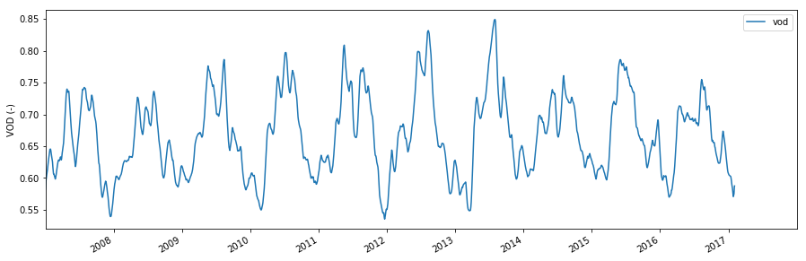

Example Vegetation Optical Depth (VOD)
--------------------------------------

In this Example we will read and plot Metop ASCAT Vegetation Optical
Depth (VOD) using the test data included in the ascat package.

.. code:: ipython2

    import os
    import matplotlib.pyplot as plt
    import ascat.tuw as tuw
    
    test_data_path = os.path.join('..', 'tests','ascat_test_data')
    sm_path = os.path.join(test_data_path, 'tuw', 'ascat', 'vod')
    grid_path = os.path.join(test_data_path, 'hsaf', 'grid')

Read VOD from grid point and plot the data using pandas builtin plot
functionality.

.. code:: ipython2

    ascat_vod_reader = tuw.AscatVodTs(sm_path, grid_path)
    
    gpi = 2199945
    vod = ascat_vod_reader.read(gpi)
    
    fig, ax = plt.subplots(1, 1, figsize=(15, 5))
    vod.plot(ax=ax)
    ax.set_ylabel('VOD (-)')
    ax.legend()
    plt.show()

